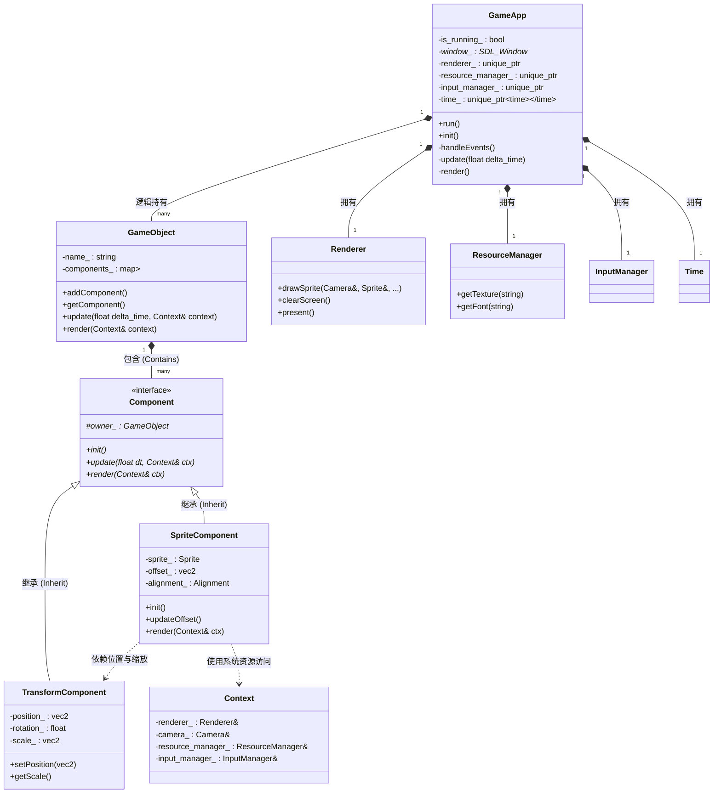
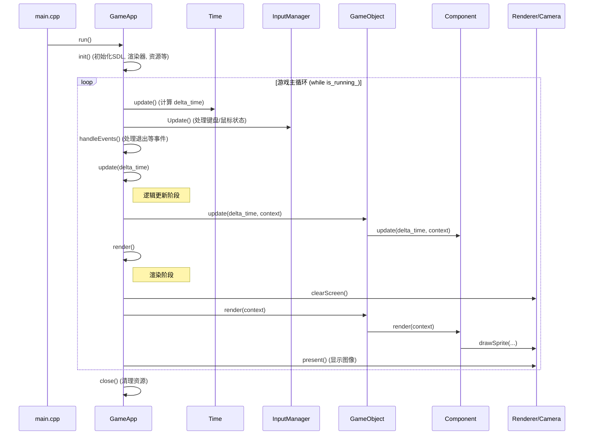

# 项目结构与调用流程 (Project Structure and Call Flow)

## 核心类图 (Core Class Diagram)

## 主循环调用流程 (Main Loop Sequence)

## 关键系统说明 (Key System Descriptions)

| 系统名称 | 职责描述 | 核心函数 |
| :--- | :--- | :--- |
| **GameApp** | 引擎入口，管理生命周期。 | `run()`, `init()`, `close()` |
| **GameObject** | 游戏实体，通过组合不同的组件来实现特定功能。 | `addComponent()`, `update()`, `render()` |
| **Component** | 组件基类，定义了游戏逻辑和渲染的统一接口。 | `init()`, `update()`, `render()` |
| **TransformComponent** | **最基础组件**，管理对象的位置、旋转、缩放。 | `getPosition()`, `setScale()` |
| **SpriteComponent** | 渲染组件，负责根据 Transform 的信息绘制图片。 | `render()`, `updateOffset()` |
| **Renderer** | 绘图核心，封装对 SDL 渲染 API 的底层调用。 | `drawSprite()`, `clearScreen()` |
| **ResourceManager**| 资源管家，负责图片、字体、声音的加载与缓存。 | `getTexture()`, `getFont()` |
| **InputManager** | 输入核心，将按键/点击映射为抽象的游戏动作。 | `Update()`, `isActionPressed()` |
| **Context** | 系统容器，将各种全局系统引用传递给组件层。 | - |

---

## 精灵与变换的关系 (Relation: Sprite & Transform)

1.  **位置绑定**: `SpriteComponent::render` 执行时，会从所属的 `GameObject` 中获取 `TransformComponent` 的位置。
2.  **坐标转换**: 最终屏幕坐标 = `Transform.Position + Sprite.Offset`。
3.  **自动缩放**: `Transform` 的 `scale` 发生变化时，`SpriteComponent` 会自动重新计算 `offset` 以保持对齐。
4.  **初始化**: `SpriteComponent::init` 时会缓存 `Transform` 的指针，确保高效访问。

