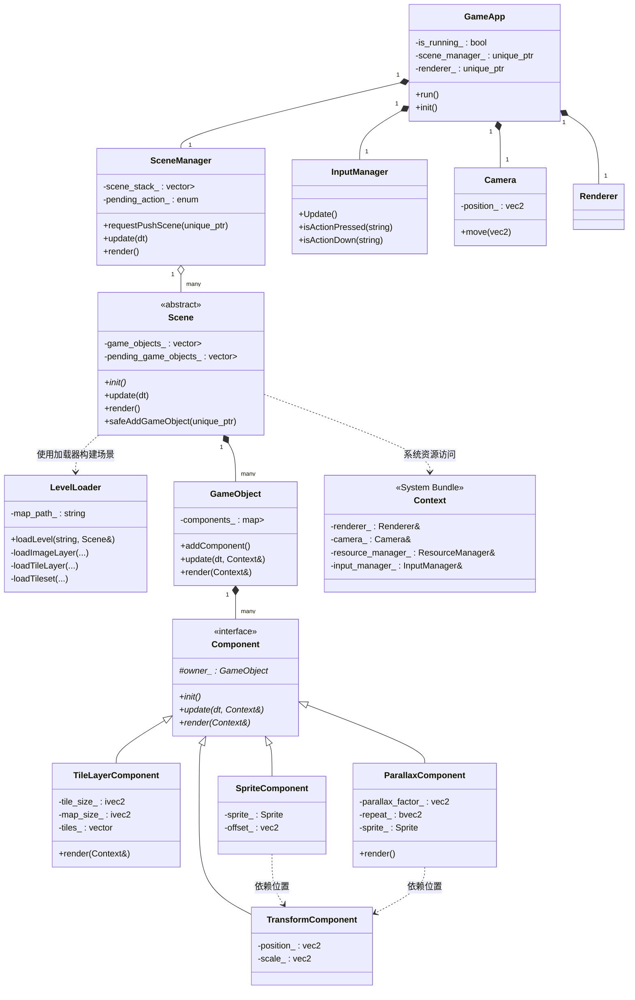
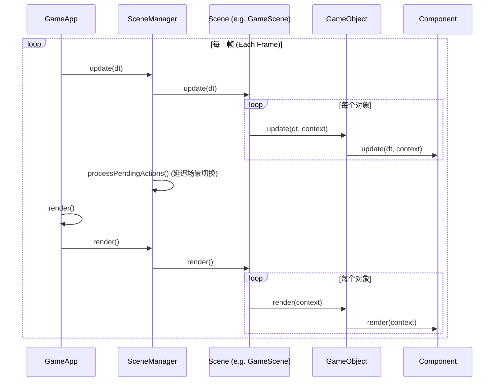

# 项目结构与调用流程 (Project Structure and Call Flow)

## 核心类图 (Core Class Diagram)



## 主循环调用流程 (Main Loop Sequence)



## 目录结构 (Directory Structure)

```text
src/
├── engine/             # 引擎核心
│   ├── core/           # 基础框架 (App, Context, Time, Config)
│   ├── scene/          # 场景管理 (Scene, SceneManager, LevelLoader)
│   ├── object/         # 游戏实体 (GameObject)
│   ├── component/      # 组件系统 (Transform, Sprite, Parallax, TileLayer)
│   ├── render/         # 渲染基础 (Renderer, Camera, Sprite)
│   ├── resource/       # 资源管理 (Texture, Font, Sound)
│   ├── input/          # 输入系统 (InputManager)
│   └── utils/          # 工具类 (Alignment, Math)
└── game/               # 游戏业务逻辑
    └── scene/          # 具体场景实现 (GameScene)
```

## 关键机制说明 (Key Mechanisms)

### 1. 场景管理 (Scene Management)
- **栈式管理**: 支持 `Push` (叠加场景，如暂停菜单) 和 `Replace` (切换场景，如转场)。
- **延迟操作**: 通过 `PendingAction` 确保在帧末尾进行场景切换，避免在更新循环中由于内存释放导致的悬空指针。

### 2. 安全的对象添加/移除 (Safe Object Management)
- **safeAddGameObject**: 将对象加入 `pending_game_objects_`。
- **safeRemoveGameObject**: 标记对象为 `need_remove_`。
- 所有操作通过 `processPendingGameObjects` 在帧末尾统一处理，确保遍历容器时的迭代器安全性。

### 3. 精灵对齐与变换 (Sprite & Transform)
- `SpriteComponent` 会监听 `TransformComponent` 的缩放变化。
- **对齐方式 (Alignment)**: 支持 `CENTER`, `TOP_LEFT` 等，通过 `offset_` 实现局部偏移。

### 4. 资源共享机制 (Resource Management)
- **ResourceManager**: 内部持有 `TextureManager`, `FontManager`, `AudioManager`。
- **自动引用计数**: 同一个路径的资源只会被加载一次，通过 `std::shared_ptr` 管理贴图等重型资源的生命周期。

### 5. 动作映射系统 (Input Mapping)
- 键盘按键不直接对应逻辑，而是映射为 **Actions** (如 `"move_left"`, `"jump"`)。
- 在 `assets/config.json` 中配置按键绑定。

### 6. 关卡加载 (Level Loading)
- **从 Tiled 导入**: 使用 `LevelLoader` 解析 Tiled 编辑器导出的 JSON 格式 (`.tmj`) 地图。
- **图块集支持**: 支持解析外部Tileset (`.tsj`)，包括大图 (`Image Collection`) 和单图集 (`Image`) 模式。
- **图层解析**: 
    - `Image Layer` -> `ParallaxComponent` (支持部分滚动因子，用于远景)。
    - `Tile Layer` -> `TileLayerComponent` (支持剔除渲染与对齐修正)。
- **路径解析**: 自动处理相对路径，确保纹理资源正确加载。

### 7. 视差滚动 (Parallax Scrolling)
- **ParallaxComponent**: 专门负责渲染背景图层的组件。
- **视差因子 (Factor)**: 通过 `parallax_factor_` 控制背景随相机移动的速度（例如 `0.2` 表示背景移动速度是相机的 0.2 倍，产生远景效果）。
- **Offset 支持**: 正确处理 Tiled 中的 `offsetx/offsety` 偏移量。

---

## 开发规范 (Development Guidelines)

### 1. 创建新场景
- 继承 `engine::scene::Scene`。
- 在 `init()` 中使用 `createGameObject` 或 `std::make_unique` 构建初始化实体。
- 通过 `scene_manager_.requestReplaceScene()` 实现场景跳转。

### 2. 创建新组件
- 继承 `engine::component::Component`。
- 逻辑代码写在 `update()` 中，渲染代码写在 `render()` 中。
- 获取同对象的其他组件请使用 `owner_->getComponent<T>()`。

### 3. 性能优化
- **避免在每帧 `update` 中分配内存**: 尽量复用对象。
- **批量渲染**: 相同纹理的对象尽量连续渲染（后续计划）。
- **资源预加载**: 在 `Scene::init()` 中一次性加载场景所需资源。

## 关键系统说明 (Key System Descriptions)

| 系统名称 | 职责描述 | 核心函数 |
| :--- | :--- | :--- |
| **GameApp** | 引擎入口，管理生命周期。 | `run()`, `init()`, `close()` |
| **GameObject** | 游戏实体，通过组合不同的组件来实现特定功能。 | `addComponent()`, `update()`, `render()` |
| **LevelLoader** | **关卡加载器**，负责解析 Tiled JSON 地图并实例化游戏对象。 | `loadLevel()`, `loadImageLayer()` |
| **Component** | 组件基类，定义了游戏逻辑和渲染的统一接口。 | `init()`, `update()`, `render()` |
| **TransformComponent** | **最基础组件**，管理对象的位置、旋转、缩放。 | `getPosition()`, `setScale()` |
| **SpriteComponent** | 渲染组件，负责根据 Transform 的信息绘制图片。 | `render()`, `updateOffset()` |
| **ParallaxComponent** | **视差组件**，用于渲染具有视差效果的背景层。 | `render()`, `getParallaxFactor()` |
| **TileLayerComponent** | **瓦片图层组件**，高效渲染由大量瓦片构成的地图层。 | `render()`, `getTileAt()` |
| **Renderer** | 绘图核心，封装对 SDL 渲染 API 的底层调用。 | `drawSprite()`, `clearScreen()` |
| **ResourceManager**| 资源管家，负责图片、字体、声音的加载与缓存。 | `getTexture()`, `getFont()` |

---
*此文档为项目架构的唯一权威说明。*


