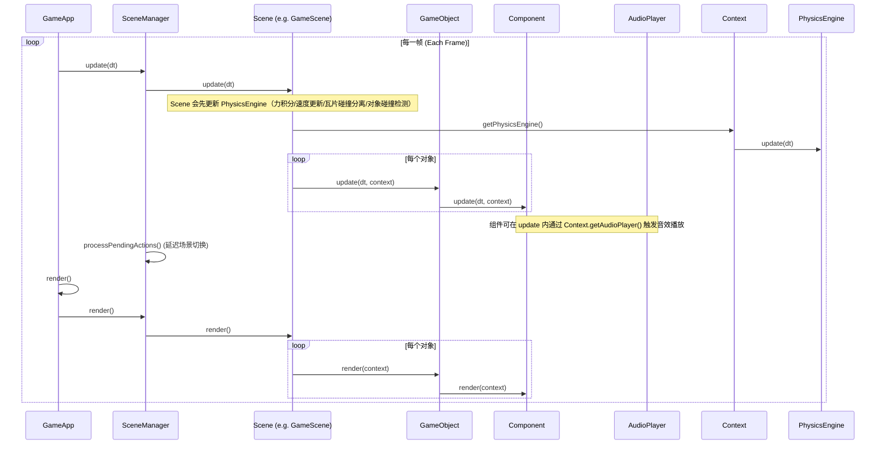

# 项目结构与调用流程 (Project Structure and Call Flow)

## 项目概述 (Project Overview)

本项目是一个基于 **C++23** 开发的 2D 游戏引擎，采用现代化的 **组件化架构 (Component-Based Architecture)**。引擎设计遵循以下核心原则：

- **组合优于继承**: 通过组件组合实现游戏对象的功能
- **数据驱动**: 使用 JSON 配置文件和 Tiled 地图编辑器进行关卡设计
- **资源共享**: 通过智能指针管理资源生命周期，避免重复加载
- **安全的内存管理**: 延迟对象添加/删除，避免迭代器失效

### 技术栈 (Tech Stack)

| 技术 | 版本 | 用途 |
|:---|:---|:---|
| **C++** | C++23 | 主开发语言 |
| **CMake** | 3.0+ | 构建系统 |
| **SDL3** | 最新版 | 窗口管理、输入、渲染 |
| **GLM** | - | 数学库（向量、矩阵） |
| **nlohmann/json** | - | JSON 解析 |
| **spdlog** | - | 日志系统 |
| **Tiled** | - | 地图编辑器 |
| **SDL3_mixer** | - | 音频解码与混音（BGM/SFX） |
| **Physics (Custom)** | - | 轻量 2D 物理（重力/速度/受力积分） |

## 核心类图 (Core Class Diagram)

```mermaid
classDiagram
    class GameApp {
        -is_running_ : bool
        -scene_manager_ : unique_ptr<SceneManager>
        -renderer_ : unique_ptr<Renderer>
        +run()
        +init()
    }

    class SceneManager {
        -scene_stack_ : vector<unique_ptr<Scene>>
        -pending_action_ : enum
        +requestPushScene(unique_ptr<Scene>)
        +update(dt)
        +render()
    }

    class Scene {
        <<abstract>>
        -game_objects_ : vector<unique_ptr<GameObject>>
        -pending_game_objects_ : vector<unique_ptr<GameObject>>
        +init()*
        +update(dt)
        +render()
        +safeAddGameObject(unique_ptr<GameObject>)
    }

    class LevelLoader {
        -map_path_ : string
        +loadLevel(string, Scene&)
        -loadImageLayer(...)
        -loadTileLayer(...)
        -loadObjectLayer(...)
        -loadTileset(...)
        -addAnimationFromTileJson(AnimationComponent*, json, vec2)
    }

    class AnimationFrame {
        +src_rect : SDL_Rect
        +duration : float
    }

    class Animation {
        -name_ : string
        -frames_ : vector<AnimationFrame>
        -total_duration_ : float
        -loop_ : bool
        +addFrame(SDL_FRect, duration)
        +getFrame(time)
    }

    class AnimationComponent {
        -animations_ : map<string, unique_ptr<Animation>>
        -current_animation_ : Animation*
        -animation_timer_ : float
        -is_playing_ : bool
        +addAnimation(unique_ptr<Animation>)
        +playAnimation(name)
        +isAnimationFinished()
    }

    class GameObject {
        -components_ : map<type_index, unique_ptr<Component>>
        +addComponent<T>()
        +update(dt, Context&)
        +render(Context&)
    }

    class Component {
        <<interface>>
        #owner_ : GameObject*
        +init()*
        +update(dt, Context&)*
        +render(Context&)*
    }

    class TileLayerComponent {
        -tile_size_ : ivec2
        -map_size_ : ivec2
        -tiles_ : vector<TileInfo>
        -offset_ : vec2
        +render(Context&)
        +getTileTypeAtWorldPos(vec2)
    }

    class TransformComponent {
        -position_ : vec2
        -scale_ : vec2
    }

    class SpriteComponent {
        -sprite_ : Sprite
        -offset_ : vec2
    }

    class ParallaxComponent {
        -parallax_factor_ : vec2
        -repeat_ : bvec2
        -sprite_ : Sprite
        +render()
    }

    class Context {
        <<System Bundle>>
        -renderer_ : Renderer&
        -camera_ : Camera&
        -resource_manager_ : ResourceManager&
        -input_manager_ : InputManager&
        -physics_engine_ : PhysicsEngine&
        -audio_player_ : AudioPlayer&
    }

    class AudioManager {
        -mixer_ : MIX_Mixer*
        -music_track_ : MIX_Track*
        -sound_track_ : MIX_Track*
        -music_ : map<string, MIX_Audio*>
        -sounds_ : map<string, MIX_Audio*>
        +getSound(path)
        +getMusic(path)
        +playSound(path)
        +playMusic(path)
        +stopSound()
        +stopMusic()
        +setMasterGain(gain)
        +setSoundGain(gain)
        +setMusicGain(gain)
        +clearAudio()
    }

    class AudioPlayer {
        -resource_manager_ : ResourceManager&
        -master_volume_ : float
        -sound_volume_ : float
        -music_volume_ : float
        -current_music_ : string
        +playSound(path)
        +playSoundSpatial(path, emitter_pos, listener_pos, max_distance)
        +playMusic(path, loops)
        +stopMusic()
        +setMasterVolume(v)
        +setSoundVolume(v)
        +setMusicVolume(v)
    }

    class AudioComponent {
        -action_sounds_ : map<string, string>
        -last_play_ticks_ : map<string, uint64>
        -min_interval_ms_ : uint64
        +registerSound(action, path)
        +playSound(id, ctx)
        +playSoundSpatial(id, ctx, listener_pos, max_distance)
        +playSoundNearCamera(id, ctx, max_distance)
        +playDirect(path, ctx)
        +setMinIntervalMs(ms)
    }

    class PhysicsEngine {
        -physics_components_ : vector<PhysicsComponent*>
        -collision_pairs_ : vector<pair<GameObject*, GameObject*>>
        -gravity_ : vec2
        -max_speed_ : float
        +update(dt)
        +resolveTileCollisions(PhysicsComponent*, dt)
        +registerPhysicsComponent(PhysicsComponent*)
        +unregisterPhysicsComponent(PhysicsComponent*)
        +getCollisionPairs()
    }

    class ColliderComponent {
        -collider_ : unique_ptr<Collider>
        -offset_ : vec2
        -alignment_ : Alignment
        +getWorldAABB()
        +getCollider()
    }

    class Collider {
        +getType()
        +getAABBSize()
    }

    class AABBCollider {
        +getType()
    }

    class CircleCollider {
        +getType()
        +getRadius()
    }

    class PhysicsComponent {
        -mass_ : float
        -use_gravity_ : bool
        -force_ : vec2
        -velocity_ : vec2
        -collided_below_ : bool
        -collided_above_ : bool
        -collided_left_ : bool
        -collided_right_ : bool
        -climbing_ : bool
        +addForce(vec2)
        +setVelocity(vec2)
        +setMass(float)
        +setUseGravity(bool)
        +setClimbing(bool)
        +isClimbing() : bool
        +hasCollidedBelow() : bool
        +hasCollidedAbove() : bool
        +hasCollidedLeft() : bool
        +hasCollidedRight() : bool
    }

    class PlayerComponent {
        -current_state_ : unique_ptr<PlayerState>
        -is_dead_ : bool
        -move_force_ : float
        -jump_force_ : float
        +setState(unique_ptr<PlayerState>)
        +processMovementInput(Context&, float)
    }

    class PlayerState {
        <<abstract>>
        #player_component_ : PlayerComponent*
        +enter()*
        +exit()*
        +handleInput(Context&)*
        +update(dt, Context&)*
    }

    class IdleState {
        +enter()
        +exit()
        +handleInput()
        +update()
    }

    class WalkState {
        +enter()
        +exit()
        +handleInput()
        +update()
    }

    class JumpState {
        +enter()
        +exit()
        +handleInput()
        +update()
    }

    class FallState {
        +enter()
        +exit()
        +handleInput()
        +update()
    }

    class HurtState {
        +enter()
        +exit()
        +handleInput()
        +update()
    }

    class DeadState {
        +enter()
        +exit()
        +handleInput()
        +update()
    }

    class ClimbState {
        +enter()
        +exit()
        +handleInput()
        +update()
    }

    class HealthComponent {
        -maxHealth_ : int
        -currentHealth_ : int
        -invincibility_duration_ : float
        -invincibility_timer_ : float
        +takeDamage(damage) : bool
        +heal(amount)
        +isAlive() : bool
        +isInvincible() : bool
        +getInvincibilityTimer() : float
    }

    class InputManager {
        +Update()
        +isActionPressed(string)
        +isActionDown(string)
    }

    class AIComponent {
        -behavior_ : unique_ptr<AIBehavior>
        +setBehavior(unique_ptr<AIBehavior>)
    }

    class AIBehavior {
        <<interface>>
        +update(dt, GameObject&)*
    }

    class PatrolBehavior {
        +update()
    }

    class UpDownBehavior {
        +update()
    }

    class JumpBehavior {
        +update()
    }

    class Camera {
        -position_ : vec2
        -target_ : TransformComponent*
        -smooth_speed_ : float
        +move(vec2)
        +setTarget(TransformComponent*)
        +update(dt)
    }

    GameApp "1" *-- "1" SceneManager
    GameApp "1" *-- "1" Renderer
    GameApp "1" *-- "1" InputManager
    GameApp "1" *-- "1" Camera
    GameApp "1" *-- "1" AudioPlayer
    SceneManager "1" o-- "many" Scene
    Scene "1" *-- "many" GameObject
    Scene ..> LevelLoader : 使用加载器构建场景

    GameObject "1" *-- "many" Component
    Component <|-- TransformComponent
    Component <|-- SpriteComponent
    Component <|-- ParallaxComponent
    Component <|-- TileLayerComponent
    Component <|-- PhysicsComponent
    Component <|-- ColliderComponent
    Component <|-- PlayerComponent
    Component <|-- AnimationComponent
    Component <|-- HealthComponent
    Component <|-- AudioComponent
    Component <|-- AIComponent
    AIComponent "1" *-- "1" AIBehavior
    AIBehavior <|-- PatrolBehavior
    AIBehavior <|-- UpDownBehavior
    AIBehavior <|-- JumpBehavior
    AnimationComponent "1" *-- "many" Animation
    Animation "1" *-- "many" AnimationFrame
    AnimationComponent ..> SpriteComponent : 驱动切片切换
    PlayerComponent "1" *-- "1" PlayerState
    PlayerComponent "1" *-- "1" HealthComponent : 依赖状态判断
    PlayerState <|-- IdleState
    PlayerState <|-- WalkState
    PlayerState <|-- JumpState
    PlayerState <|-- FallState
    PlayerState <|-- HurtState
    PlayerState <|-- DeadState
    PlayerState <|-- ClimbState
    Collider <|-- AABBCollider
    Collider <|-- CircleCollider
    SpriteComponent ..> TransformComponent : 依赖位置
    ParallaxComponent ..> TransformComponent : 依赖位置
    Scene ..> Context : 系统资源访问
    PhysicsComponent ..> TransformComponent : 写入位置
    PhysicsComponent ..> PhysicsEngine : 注册更新
    PhysicsEngine ..> PhysicsComponent : 管理更新列表
    ColliderComponent ..> TransformComponent : 提供世界坐标AABB
    PhysicsEngine ..> ColliderComponent : 碰撞检测
    PhysicsEngine ..> TileLayerComponent : 瓦片碰撞分离

    ResourceManager "1" *-- "1" AudioManager
    Context "1" o-- "1" AudioPlayer
    AudioPlayer ..> ResourceManager : 通过资源系统获取音频
    AudioComponent ..> Context : 通过 Context 调用 AudioPlayer
```



## 主循环调用流程 (Main Loop Sequence)



## 目录结构 (Directory Structure)

```text
src/
├── engine/             # 引擎核心
│   ├── core/           # 基础框架 (App, Context, Time, Config)
│   ├── audio/          # 音频播放封装 (AudioPlayer)
│   ├── scene/          # 场景管理 (Scene, SceneManager, LevelLoader)
│   ├── object/         # 游戏实体 (GameObject)
│   ├── component/      # 组件系统
│   │   ├── transform_component.h
│   │   ├── sprite_component.h
│   │   ├── physics_component.h
│   │   ├── collider_component.h
│   │   ├── animation_component.h
│   │   ├── health_component.h
│   │   ├── audio_component.h
│   │   ├── ai_component.h
│   │   └── behaviors/  # AI 行为策略 (Patrol, UpDown, Jump)
│   ├── physics/         # 物理系统 (PhysicsEngine)
│   ├── render/         # 渲染基础 (Renderer, Camera, Sprite)
│   ├── resource/       # 资源管理 (Texture, Font, Sound)
│   │   └── audio_manager.h
│   ├── input/          # 输入系统 (InputManager)
│   └── utils/          # 工具类 (Alignment, Math)
└── game/               # 游戏业务逻辑
├── scene/          # 具体场景实现 (GameScene)
└── component/      # 游戏特定的组件 (PlayerComponent, State Machine)

assets/                 # 游戏资源
├── config.json          # 输入映射、窗口参数等配置
├── maps/                # Tiled 导出的地图（.tmj/.tsj）
├── textures/            # 贴图资源
├── fonts/               # 字体资源
└── sounds/              # 音频资源

docs/                   # 项目文档
└── PROJECT_STRUCTURE.md # 本文档：结构、调用流程与约定

out/                    # CMake 默认构建输出（由 IDE/生成器产生）
└── build/<config>/      # 例如 x64-debug, x64-release
```

## 关键机制说明 (Key Mechanisms)

### 1. 场景管理 (Scene Management)
- **栈式管理**: 支持 `Push` (叠加场景，如暂停菜单) 和 `Replace` (切换场景，如转场)。
- **延迟操作**: 通过 `PendingAction` 确保在帧末尾进行场景切换，避免在更新循环中由于内存释放导致的悬空指针。

### 2. 安全的对象添加/移除 (Safe Object Management)
- **safeAddGameObject**: 将对象加入 `pending_game_objects_`。
- **safeRemoveGameObject**: 标记对象为 `need_remove_`。
- 所有操作通过 `processPendingGameObjects` 在帧末尾统一处理，确保遍历容器时的迭代器安全性。

### 3. 精灵对齐与变换 (Sprite & Transform)
- `SpriteComponent` 会监听 `TransformComponent` 的缩放变化。
- **对齐方式 (Alignment)**: 支持 `CENTER`, `TOP_LEFT` 等，通过 `offset_` 实现局部偏移。

### 4. 资源共享机制 (Resource Management)
- **ResourceManager**: 内部持有 `TextureManager`, `FontManager`, `AudioManager`。
- **自动引用计数**: 同一个路径的资源只会被加载一次，通过 `std::shared_ptr` 管理贴图等重型资源的生命周期。

### 5. 音频系统 (Audio)

本项目新增了基于 `SDL3_mixer` 的音频子系统，用于统一处理 **背景音乐（BGM）** 与 **音效（SFX）** 的加载、缓存与播放。

#### 组成与职责

- `engine::resource::AudioManager`
  - 负责初始化/关闭 `SDL3_mixer` 设备。
  - 采用懒加载 + 缓存：按文件路径缓存 `MIX_Audio`。
  - 内部分离两条轨道：`music_track_`（BGM）与 `sound_track_`（SFX）。
  - 提供 `setMasterGain/setMusicGain/setSoundGain` 作为底层增益控制入口。

- `engine::audio::AudioPlayer`
  - 面向“播放/控制”的高层封装，依赖 `ResourceManager` 间接访问 `AudioManager`。
  - 提供 master/sound/music 三种音量倍率（float），并在播放时统一应用。
  - 支持 `playSoundSpatial()`：根据发声体与监听者（通常是相机中心）的距离进行衰减，`max_distance` 之外可静音/不播放。
  - 负责记录当前正在播放的 BGM（`current_music_`），避免重复切歌。

- `engine::component::AudioComponent`
  - 轻量组件：将“动作/事件（action/id）”映射到音频资源路径。
  - 支持最小触发间隔节流（`min_interval_ms_`），避免例如“走路/落地”事件被每帧触发造成爆音。
  - 支持通过 `playSoundNearCamera()` 直接以相机作为监听点触发空间化音效。

#### 调用链路（SFX 示例）

1) 业务/组件触发：`AudioComponent::playSound("jump", context)`

2) 组件通过 `context.getAudioPlayer()` 调用：`AudioPlayer::playSound(path)`

3) `AudioPlayer` 通过 `ResourceManager` 获取/复用音频资源并交给 `AudioManager` 播放

> 约定：音频路径与其他资源一致，均以项目根目录为相对基准（例如 `assets/sounds/jump.wav`）。

### 6. 动作映射系统 (Input Mapping)
- 键盘按键不直接对应逻辑，而是映射为 **Actions** (如 `"move_left"`, `"jump"`, `"move_up"`, `"move_down"`)。
- 在 `assets/config.json` 中配置按键绑定。

### 7. 关卡加载 (Level Loading)
- **从 Tiled 导入**: 使用 `LevelLoader` 解析 Tiled 编辑器导出的 JSON 格式 (`.tmj`) 地图。
- **图块集支持**: 支持解析外部Tileset (`.tsj`)，包括大图 (`Image Collection`) 和单图集 (`Image`) 模式。
- **图层解析**: 
    - `Image Layer` -> `ParallaxComponent` (支持部分滚动因子，用于远景)。
    - `Tile Layer` -> `TileLayerComponent` (支持剔除渲染与对齐修正)。
        - **物理类型支持**: 支持 `SOLID` (碰撞)、`HAZARD` (伤害区域)、`LADDER` (可攀爬区域) 以及多种角度的 `SLOPE` (斜坡)。
    - `Object Layer` -> `GameObject` (将Tiled对象实例化为带`Transform`, `Sprite`组件的实体)。
- **路径解析**: 自动处理相对路径，确保纹理资源正确加载。

### 8. 视差滚动 (Parallax Scrolling)
- **ParallaxComponent**: 专门负责渲染背景图层的组件。
- **视差因子 (Factor)**: 通过 `parallax_factor_` 控制背景随相机移动的速度（例如 `0.2` 表示背景移动速度是相机的 0.2 倍，产生远景效果）。
- **Offset 支持**: 正确处理 Tiled 中的 `offsetx/offsety` 偏移量。

### 9. 动画系统 (Animation System)
- **基于时间的播放**: 动画逻辑与帧率无关。`AnimationComponent` 通过累计 `delta_time` 并在 `Animation` 对象中检索对应时刻的 `AnimationFrame`。
- **循环控制**: 
    - 循环动画使用 `fmod` 处理溢出时间，确保循环逻辑无漂移。
    - 非循环动画在到达 `total_duration` 后会自动停止并锁定在最后一帧，避免出现闪烁回到第一帧的 Bug。
- **数据驱动**: 动画数据可以直接定义在 Tiled 的 Tileset 属性中（JSON 字符串格式），由 `LevelLoader` 自动解析并挂载。
- **与 Sprite 交互**: `AnimationComponent` 每帧计算出当前的 `src_rect` 后，直接调用 `SpriteComponent::setSourceRect()` 更新渲染内容。

### 10. 物理系统 (Physics)

- **PhysicsEngine**: 维护所有 `PhysicsComponent` 的注册列表，并在每帧统一调用 `update(dt)`。
- **PhysicsComponent**: 作为组件挂载到 `GameObject` 上，内部持有速度、受力、质量等数据，并在 `init/clean` 时向 `PhysicsEngine` 注册/注销。

#### 更新顺序

- 当前引擎实现中，`Scene::update(dt)` 会最先调用 `context_.getPhysicsEngine().update(dt)`，随后再更新每个 `GameObject` 的逻辑组件。

#### 单位约定

- `Time::getDeltaTime()` 输出单位为 **秒 (s)**。
- `PhysicsEngine` 内的 `gravity_` 以 **像素/秒²** 表示（默认约 `980`）。
- `PhysicsComponent::velocity_` 以 **像素/秒** 表示。

#### 当前限制（后续可扩展）

- 目前已实现 **基础碰撞检测**：`PhysicsEngine` 在 `update(dt)` 末尾执行 `checkObjectCollisions()`，对注册的物理对象两两检测碰撞。
- 碰撞基于 `ColliderComponent` + `engine::physics::collision::checkCollision()`：
  - 先做世界坐标 AABB 粗检（broad-phase）
  - 通过碰撞体类型再做细检（narrow-phase）：AABB/AABB、Circle/Circle、AABB/Circle
- 检测结果会写入 `PhysicsEngine::collision_pairs_`，并可通过 `PhysicsEngine::getCollisionPairs()` 读取（用于调试/测试）。

此外已实现 **瓦片碰撞分离（Tile collision resolve）**：

- `PhysicsEngine::update(dt)` 在对每个 `PhysicsComponent` 积分速度后调用 `resolveTileCollisions(pc, dt)`。
- `resolveTileCollisions()` 会根据物体的 `ColliderComponent` 世界 AABB 与 `TileLayerComponent` 的 SOLID 瓦片进行分离：
  - 采用 **分离轴 sweep**（先 X 后 Y）避免角落处左右方向表现不一致。
  - 采用对称 `eps`（很小值）对 AABB 边界向内缩，避免 `floor()` 带来的左右/上下取整不对称。
  - **斜坡物理增强**:
    - **自动吸附 (Snap/Stickiness)**: 在 `resolveYAxisCollision` 中实现了吸附逻辑，允许玩家在走下坡时保持贴地，避免因重力积分滞后导致的脱离地面和状态闪烁。
    - **即时状态更新**: 在水平移动（X轴）发生斜坡修正时，立即更新 `collided_below_` 标志，确保后续逻辑（如下一帧的初速度判定）正确。
    - **判定鲁棒性**: 选取检测范围内 Y 值最小（即物理高度最高）的斜坡面作为支撑面，彻底消除多重碰撞重叠时的“弹出”Bug。
    - **吸附禁用 (Snap Suppression)**: 提供的 `suppressSnapFor(seconds)` 方法允许状态机在起跳或特殊切出时暂时禁用吸附逻辑，防止被 Stickiness 拉回斜坡。
  - **梯子中心对齐**: 在进入攀爬（尤其是从上方边缘下落进入）时，引擎会自动计算梯子列的中心 X 坐标并将玩家吸附过去，确保动画展现的对齐。
  - 采样瓦片坐标时使用与 `TileLayerComponent::getTileTypeAtWorldPos()` 一致的世界偏移：`layer->getOffset() + layer_owner->Transform.position`，避免渲染与碰撞坐标系不一致。
  - 发生碰撞时将对应轴速度分量置零（例如撞墙清零 `velocity_.x`，落地清零 `velocity_.y`）。

### 每个场景的独特系统 (Scene Specific Systems)

#### 1. 相机平滑跟随 (Smooth Camera Follow)
- **目标绑定**: `Camera` 支持绑定一个 `TransformComponent` 作为 `target_`。
- **平滑插值**: 使用 `glm::mix` (Lerp) 实现基于时间的平滑位移，计算公式为 `current = mix(current, target, factor * dt)`，有效滤除角色快速运动引起的视觉抖动。
- **边界约束**: 使用 `clampPosition` 确保相机不会露出地图黑边。

#### 调试用例（GameScene）

`game::scene::GameScene` 内置了一个简单的碰撞测试用例（便于快速验证碰撞检测链路）：

- `test_object`：受重力影响的箱子，带 `AABBCollider(32x32)`
- `test_object2`：静止物体，不受重力，带 `CircleCollider(radius=16)`

在 `GameScene::update()` 中会调用 `TestCollisionPairs()`，每帧遍历并打印 `PhysicsEngine::getCollisionPairs()`。

### 11. 碰撞系统 (Collision)

- **Collider / ColliderType**：形状定义，当前支持 `AABB` 与 `CIRCLE`。
- **ColliderComponent**：挂载到 `GameObject` 上，持有 `Collider`，并可计算世界坐标 AABB（`getWorldAABB()`）。
- **collision 命名空间**：提供检测函数（`checkCollision`、`checkAABBOverlap`、`checkCircleOverlap`、`checkPointInCircle` 等）。
- **接入点**：`PhysicsEngine::checkObjectCollisions()` 调用 `collision::checkCollision()`，并记录碰撞对到 `collision_pairs_`。

### 12. Transform / Alignment 约定（渲染与碰撞坐标基准）

本项目中多个组件都会把 `TransformComponent::position` 当作“锚点”，其实际世界左上角由各组件的 `Alignment` 计算出的 `offset_` 决定：

- `SpriteComponent::render()` 使用 `draw_pos = transform_pos + sprite_offset_`。
- `ColliderComponent::getWorldAABB()` 使用 `aabb_top_left = transform_pos + collider_offset_`。

注意：

- `SpriteComponent` 的默认 `alignment` 为 `Alignment::NONE`，在现实现中等价于不做偏移（`offset_ = (0,0)`），也就是把 `Transform.position` 当作贴图左上角。
- `ColliderComponent` 若设置为 `Alignment::CENTER`，会产生 `offset_ = (-w/2, -h/2)`，此时 `Transform.position` 被当作碰撞盒中心。

因此如果只把 Collider 改为 `CENTER` 而 Sprite 仍为默认 `NONE`，会出现“碰撞盒贴地但贴图嵌入地面/错位”的视觉现象。

建议：

- 让 `SpriteComponent` 与 `ColliderComponent` 使用一致的 `Alignment`（例如都用 `TOP_LEFT` 或都用 `CENTER`）。
- 或制定全局约定：`Transform.position` 永远表示左上角/永远表示中心，并让所有组件遵循。

### 13. 玩家状态机 (Player State Machine)

本项目使用 **状态模式 (State Pattern)** 管理玩家的复杂行为逻辑。

- **PlayerComponent**: 玩家的核心组件，持有当前状态 (`current_state_`) 和物理属性（速度参数、跳跃力等）。
  - 提供 `setState()` 切换状态（自动调用 `exit()` 和 `enter()`）。
  - 提供 `processMovementInput()` 辅助函数，供各状态调用以处理通用的左右移动逻辑（施加力、翻转精灵、处理转向瞬间的速度归零）。

- **PlayerState**: 所有玩家状态的基类 (抽象类)。
  - `enter()`: 进入状态时调用（初始化动画、重置变量）。
  - `exit()`: 退出状态时调用（清理）。
  - `handleInput()`: 处理输入，返回新状态（`unique_ptr`）或 `nullptr`（保持当前状态）。
  - `update()`: 帧更新逻辑，处理物理检测、自动状态切换（如落地、起跳）。

- **具体状态**:
  - `IdleState`: 待机状态。检测移动输入切换 `WalkState`，检测跳跃切换 `JumpState`，检测下落。
  - `WalkState`: 移动状态。处理移动输入，检测停止输入回 `IdleState`。
  - `JumpState`: 跳跃上升状态。进入时施加向上速度，并进行微小的垂直位移（抬升）以确保离开地表。起跳瞬间会调用 `suppressSnapFor()` 禁用斜坡吸附，防止在斜坡边缘被立即拉回。同时会重置“土狼计时器”为 0。空中可移动，检测 Y 轴速度向下切换 `FallState`。
  - `FallState`: 下落状态。空中可移动。检测地面碰撞 (`hasCollidedBelow`) 切换 `Idle/Walk`。支持“土狼计时器” (Coyote Time)：允许玩家在离开平台后的短暂宽限期内仍然可以起跳。
  - `HurtState`: 受伤状态。进入时播放受伤动画，通常在受击瞬间从其他状态切入。
  - `DeadState`: 死亡状态。进入时播放死亡动画，禁用大部分输入处理，准备从场景移除。
  - `ClimbState`: 攀爬状态。在梯子范围内触发。进入时禁用重力，允许垂直移动和微量水平位移，通过检测梯子范围自动退出或切出跳转。

### 14. 生命值系统 (Health System)

- **HealthComponent**: 独立管理实体的生命值生命周期。
  - **无敌帧 (Invincibility Frames)**: 采用计时器机制。受伤后 `invincibility_timer_` 被设为 `invincibility_duration_`，随后随时间递减（在 `update` 中处理）。只要计时器大于 0，`isInvincible()` 即返回 true，实体免受伤害。
  - **受击逻辑**: `takeDamage()` 包含无敌状态检查。扣血成功后，会自动触发无敌计时。
- **与状态机连接**: `PlayerComponent` 监听生命值变化并根据无敌计时器驱动 `SpriteComponent` 实现闪烁反馈。当 `HealthComponent` 触发扣血时，`PlayerComponent` 会切换到 `HurtState` 或 `DeadState`。

### 15. 危险处理与场景反馈 (Hazard Processing & Feedback)

- **处理统一化**: `GameScene::processHazardDamage()` 统一处理玩家受到的环境伤害（如尖刺瓦片或尖刺对象），确保伤害判定的触发逻辑一致。
- **效果对齐**: `GameScene::createEffect()` 支持多种标签（如 "enemy", "item"），并根据动画帧尺寸自动应用位置偏移，确保特效中心点与触发位置精准重叠。

### 16. 状态机与物理系统的交互 (Physics & State Machine Interaction)

- **碰撞标记 (Collision Flags)**: `PhysicsComponent` 实时维护四个方向的碰撞标记：`below`, `above`, `left`, `right`。
- **状态切换依据**: 
  - `IdleState` 和 `WalkState` 会每帧检查 `!hasCollidedBelow()`，如果为真则代表玩家悬空，此时会设置“土狼计时器”并立即切换到 `FallState`。
  - `FallState` 会检查 `coyote_timer_`，如果大于 0 且按下跳跃键，则允许返回 `JumpState`。
  - `FallState` 会每帧检查 `hasCollidedBelow()`，如果为真则代表玩家落地，立即切换到 `IdleState` 或 `WalkState`。
  - **攀爬交互**: `ClimbState` 会修改 `PhysicsComponent` 的 `climbing` 标志并调用 `setUseGravity(false)`。在更新逻辑中通过在头、中、足三个关键采样点探测 `LADDER` 瓦片来判断玩家是否仍处于梯子有效区域。
- **输入处理辅助**: `PlayerComponent::processMovementInput()` 封装了左右移动的力学逻辑。在空中状态（`Jump/Fall`）调用时通常会传入较小的速度系数（如 `0.5f`）以实现受限的空中控制。

### 17. AI 行为系统 (AI Behavior System)

本项目采用 **策略模式 (Strategy Pattern)** 实现敌人的 AI 逻辑。

- **AIComponent**: 挂载到敌对 NPC 上的组件，内部持有一个 `AIBehavior` 策略对象。
  - 每帧驱动 `current_behavior_->update()`，将具体逻辑逻辑委托给策略类。
- **AIBehavior (抽象基类)**: 定义了统一的 `update(delta_time, game_object)` 接口。
- **具体策略**:
  - `PatrolBehavior`: 基础左右巡逻。支持设置巡逻范围和移动速度。
  - `UpDownBehavior`: 垂直飞行巡逻。常用于 Eagle 等飞行敌人。
  - `JumpBehavior`: 周期性跳跃移动。模拟 Frog 的动作，结合物理引擎实现抛物线跳跃。

### 18. 战斗判定 (Combat Detection)

- **踩踏判定 (Stomp Logic)**:
  - 优化后的 `PlayerVSEnemyCollision` 不再仅依赖重叠区域的长宽比。
  - **判定条件**: 1. 玩家垂直速度向下 (`velocity.y > 0`)； 2. 玩家足部 AABB 边界在敌人中心线上方。
  - **效果**: 判定成功则调用敌人 `HealthComponent` 扣血，并赋予玩家瞬时的向上冲量（反弹跳）。判定失败则玩家受损。

## 开发规范 (Development Guidelines)

### 1. 创建新场景
- 继承 `engine::scene::Scene`。
- 在 `init()` 中使用 `createGameObject` 或 `std::make_unique` 构建初始化实体。
- 通过 `scene_manager_.requestReplaceScene()` 实现场景跳转。

### 2. 创建新组件
- 继承 `engine::component::Component`。
- 逻辑代码写在 `update()` 中，渲染代码写在 `render()` 中。
- 获取同对象的其他组件请使用 `owner_->getComponent<T>()`。

### 4. 使用 PhysicsComponent（示例）

- 给对象添加物理：`addComponent<PhysicsComponent>(&context_.getPhysicsEngine())`
- 关闭重力：`setUseGravity(false)`
- 施加一次性力：`addForce(...)`（会在该帧计算完后清空）
- 直接设置速度：`setVelocity(...)`（用于跳跃/冲量类效果）

### 5. 使用音频系统（示例）

#### 方式 A：组件内按 action/id 播放

- 给对象添加音频组件：`addComponent<AudioComponent>()`
- 注册音效映射：`registerSound("jump", "assets/sounds/jump.wav")`
- 设置节流（可选）：`setMinIntervalMs(80)`
- 触发播放：`playSound("jump", context)`

#### 方式 B：直接播放路径

- 直接播放某个文件：`context.getAudioPlayer().playSound("assets/sounds/coin.wav")`
- 播放 BGM：`context.getAudioPlayer().playMusic("assets/music/level1.ogg")`

### 3. 性能优化
- **避免在每帧 `update` 中分配内存**: 尽量复用对象。
- **批量渲染**: 相同纹理的对象尽量连续渲染（后续计划）。
- **资源预加载**: 在 `Scene::init()` 中一次性加载场景所需资源。

---

## 项目约定 (Conventions)

### 命名规范
- **类名**: `PascalCase` (如 `GameObject`, `SpriteComponent`)
- **函数名**: `camelCase` (如 `addComponent()`, `getPosition()`)
- **成员变量**: `snake_case_` 带下划线后缀 (如 `position_`, `sprite_`)
- **常量**: `UPPER_SNAKE_CASE` (如 `MAX_SPEED`)

### 文件组织
- 头文件: `.h`
- 实现文件: `.cpp`
- 每个类一个文件
- 文件名与类名一致（snake_case）

### 资源路径
- 所有资源路径相对于**项目根目录**
- 纹理: `assets/textures/`
- 地图: `assets/maps/`
- 音频: `assets/sounds/` 和 `assets/music/`
- 字体: `assets/fonts/`
- 配置: `assets/config.json`

### 组件依赖
- **TransformComponent**: 基础组件，几乎所有对象都需要
- **SpriteComponent**: 依赖 `TransformComponent`
- **ParallaxComponent**: 依赖 `TransformComponent`
- **自定义组件**: 根据需要添加依赖

---


## 关键系统说明 (Key System Descriptions)

| 系统名称 | 职责描述 | 核心函数 | 备注 |
| :--- | :--- | :--- | :--- |
| **GameApp** | 引擎入口，管理生命周期、主循环。 | `run()`, `init()`, `close()` | 单例模式 |
| **GameObject** | 游戏实体，通过组合不同的组件来实现特定功能。 | `addComponent()`, `update()`, `render()`, `getComponent()` | 支持名称和标签 |
| **LevelLoader** | **关卡加载器**，负责解析 Tiled JSON 地图并实例化游戏对象。 | `loadLevel()`, `loadImageLayer()`, `loadTileLayer()` | 支持 .tmj 和 .tsj |
| **Component** | 组件基类，定义了游戏逻辑和渲染的统一接口。 | `init()`, `update()`, `render()` | 纯虚基类 |
| **TransformComponent** | **最基础组件**，管理对象的位置、旋转、缩放。 | `getPosition()`, `setScale()`, `move()` | 必需组件 |
| **SpriteComponent** | 渲染组件，负责根据 Transform 的信息绘制图片。 | `render()`, `updateOffset()`, `setAlignment()` | 依赖 Transform |
| **ParallaxComponent** | **视差组件**，用于渲染具有视差效果的背景层。 | `render()`, `getParallaxFactor()` | 用于 Image Layer |
| **TileLayerComponent** | **瓦片图层组件**，高效渲染由大量瓦片构成的地图层。 | `render()`, `getTileAt()` | 支持视口剔除 |
| **SceneManager** | 场景管理器，负责场景栈的管理和切换。 | `requestPushScene()`, `requestReplaceScene()`, `requestPopScene()` | 延迟操作 |
| **Scene** | 场景基类，容纳游戏对象。 | `init()`, `update()`, `render()`, `addGameObject()` | 抽象基类 |
| **Renderer** | 绘图核心，封装对 SDL 渲染 API 的底层调用。 | `drawSprite()`, `clearScreen()`, `present()` | 单例模式 |
| **ResourceManager**| 资源管家，负责图片、字体、声音的加载与缓存。 | `getTexture()`, `getFont()`, `getSound()` | 自动引用计数 |
| **AudioManager** | 音频资源管理器，负责初始化混音器并缓存音乐/音效资源。 | `getSound()`, `getMusic()`, `playSound()`, `playMusic()` | 基于 `SDL3_mixer` |
| **AudioPlayer** | 高层播放控制器，统一音量、BGM 切换与空间化播放。 | `playSound()`, `playSoundSpatial()`, `playMusic()`, `stopMusic()` | 通过 `Context` 全局访问 |
| **InputManager** | 输入管理器，处理键盘、鼠标、手柄输入。 | `isActionDown()`, `isActionPressed()`, `Update()` | 动作映射系统 |
| **Camera** | 相机系统，控制视图位置。 | `move()`, `setPosition()`, `getPosition()` | 影响所有渲染 |
| **Context** | 系统上下文，提供对各个管理器的访问。 | `getRenderer()`, `getCamera()`, `getResourceManager()` | 依赖注入 |
| **PhysicsEngine** | 物理系统入口，统一更新所有物理组件并执行基础碰撞检测。 | `update()`, `registerPhysicsComponent()`, `getCollisionPairs()` | 记录碰撞对供调试 |
| **ColliderComponent** | 碰撞组件，提供碰撞体形状并计算世界坐标 AABB。 | `getWorldAABB()`, `getCollider()` | 参与碰撞检测 |
| **PhysicsComponent** | 物理组件，保存质量/速度/受力并影响 Transform。 | `addForce()`, `setVelocity()` | 由 PhysicsEngine 驱动 |
| **HealthComponent** | 生命值组件，管理 HP、受伤、治疗及无敌帧计时。 | `takeDamage()`, `isInvincible()`, `isAlive()` | 支持自动无敌反馈逻辑 |
| **AudioComponent** | 音频组件，将动作/事件映射到音频路径并触发播放（含节流/空间化）。 | `registerSound()`, `playSound()`, `playSoundNearCamera()` | 依赖 `Context` |
| **PlayerComponent** | 玩家控制组件，通过状态机驱动玩家行为逻辑。 | `processMovementInput()`, `setState()` | 业务逻辑核心 |
| **PlayerState** | 玩家状态抽象，定义了不同动作下的行为逻辑。 | `handleInput()`, `update()` | 状态模式实现 |
| **AIComponent** | **AI 逻辑组件**，通过注入不同的 Behavior 策略实现各种敌人行为。 | `setBehavior()`, `update()` | 策略模式实现 |

---

## 组件通信 (Component Communication)

### 方式 1: 通过 GameObject 获取其他组件
```cpp
void MyComponent::update(float dt, engine::core::Context& ctx) {
    // 获取同对象的其他组件
    auto* transform = owner_->getComponent<TransformComponent>();
    auto* sprite = owner_->getComponent<SpriteComponent>();
    
    if (transform && sprite) {
        // 使用组件数据
    }
}
```

### 方式 2: 通过 Scene 查找对象
```cpp
// 在 Scene 中添加查找方法（需自行实现）
GameObject* Scene::findGameObjectByName(const std::string& name);
GameObject* Scene::findGameObjectByTag(const std::string& tag);
std::vector<GameObject*> Scene::findGameObjectsByTag(const std::string& tag);
```

### 方式 3: 事件系统（可选扩展）
```cpp
// 未来可以添加事件总线模式
EventBus::publish("player_died", player_data);
EventBus::subscribe("player_died", [](auto data) { /* handle */ });
```

---

## 生命周期详解 (Lifecycle Details)

### GameObject 生命周期
```
创建 (new/make_unique)
    ↓
添加组件 (addComponent)
    ↓
添加到场景 (scene.addGameObject)
    ↓
初始化 (Component::init) - 在下一帧开始时
    ↓
每帧更新 (update) ←─┐
    ↓                │
每帧渲染 (render)    │
    ↓                │
检查移除标志 ────────┘
    ↓
标记为移除 (setNeedRemove)
    ↓
从场景移除并销毁 (在帧末尾)
```

### Scene 生命周期
```
创建场景 (make_unique<Scene>)
    ↓
请求切换 (SceneManager::requestReplaceScene)
    ↓
等待当前帧结束
    ↓
移除旧场景 (clean + 析构)
    ↓
添加新场景到栈
    ↓
初始化场景 (Scene::init)
    ↓
进入主循环 (update/render)
```

### Component 生命周期
```
创建 (GameObject::addComponent)
    ↓
设置 owner (Component::setOwner)
    ↓
初始化 (Component::init)
    ↓
每帧执行 ←─┐
    ↓      │
update()   │
    ↓      │
render()   │
    └──────┘
    ↓
GameObject 销毁时自动析构


