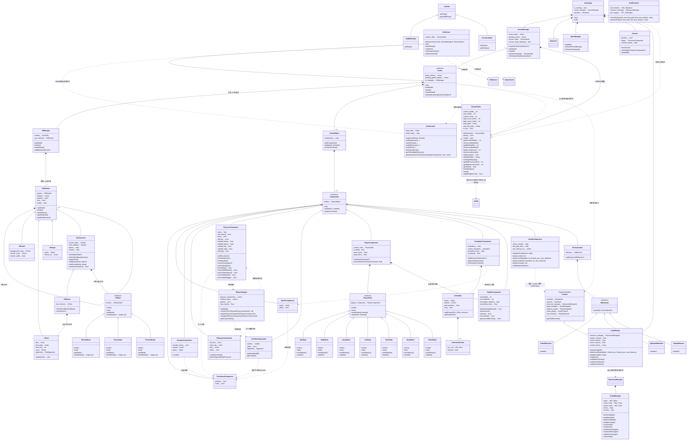

# 核心类图 (Core Class Diagram)

```mermaid
classDiagram
    class GameApp {
        -is_running_ : bool
        -scene_manager_ : SceneManager*
        -renderer_ : Renderer*
        +run()
        +init()
    }

    class SceneManager {
        -scene_stack_ : vector<Scene*>
        -pending_action_ : enum
        -session_data_ : SessionData*
        -session_data_initialized_ : bool
        +requestPushScene(Scene*)
        +update(dt)
        +render()
        +getSessionData() : SessionData*
        +setSessionData(SessionData*)
    }

    class Scene {
        <<abstract>>
        -game_objects_ : vector<GameObject*>
        -pending_game_objects_ : vector<GameObject*>
        -ui_manager_ : UIManager*
        +init()*
        +update(dt)
        +render()
        +handleInput()
        +safeAddGameObject(GameObject*)
    }

    class EndScene {
        -session_data_ : SessionData*
        +EndScene(Context&, SceneManager&, SessionData*)
        +init()
        +handleInput()
        +createUI()
        +onRestartClicked()
        +onBackClicked()
    }

    class LevelLoader {
        -map_path_ : string
        -tileset_data_ : map<int, json>
        +loadLevel(string, Scene&)
        -loadImageLayer(...)
        -loadTileLayer(...)
        -loadObjectLayer(...)
        -loadTileset(...)
        -findTileset(int gid)
        -getTileDataByGid(int gid)
        -addAnimationFromTileJson(AnimationComponent*, json, vec2)
    }

    class AnimationFrame {
        +src_rect : SDL_Rect
        +duration : float
    }

    class Animation {
        -name_ : string
        -frames_ : vector<AnimationFrame>
        -total_duration_ : float
        -loop_ : bool
        +addFrame(SDL_FRect, duration)
        +getFrame(time)
    }

    class AnimationComponent {
        -animations_ : map<string, Animation*>
        -current_animation_ : Animation*
        -animation_timer_ : float
        -is_playing_ : bool
        +addAnimation(Animation*)
        +playAnimation(name)
        +isAnimationFinished()
    }

    class GameObject {
        -components_ : map<string, Component*>
        +addComponent<T>()
        +update(dt, Context&)
        +render(Context&)
    }

    class Component {
        <<interface>>
        #owner_ : GameObject*
        +init()*
        +update(dt, Context&)*
        +render(Context&)*
    }

    class TileLayerComponent {
        -tile_size_ : ivec2
        -map_size_ : ivec2
        -tiles_ : vector<TileInfo>
        -offset_ : vec2
        +render(Context&)
        +getTileTypeAtWorldPos(vec2)
    }

    class TransformComponent {
        -position_ : vec2
        -scale_ : vec2
    }

    class SpriteComponent {
        -sprite_ : Sprite
        -offset_ : vec2
    }

    class ParallaxComponent {
        -parallax_factor_ : vec2
        -repeat_ : bvec2
        -sprite_ : Sprite
        +render()
    }

    class Context {
        <<System Bundle>>
        -renderer_ : Renderer&
        -camera_ : Camera&
        -resource_manager_ : ResourceManager&
        -input_manager_ : InputManager&
        -physics_engine_ : PhysicsEngine&
        -audio_player_ : AudioPlayer&
        -text_renderer_ : TextRenderer&
        +getTextRenderer()
    }

    class AudioManager {
        -mixer_ : MIX_Mixer*
        -music_track_ : MIX_Track*
        -sound_track_ : MIX_Track*
        -music_ : map<string, MIX_Audio*>
        -sounds_ : map<string, MIX_Audio*>
        +getSound(path)
        +getMusic(path)
        +playSound(path)
        +playMusic(path)
        +stopSound()
        +stopMusic()
        +setMasterGain(gain)
        +setSoundGain(gain)
        +setMusicGain(gain)
        +clearAudio()
    }

    class AudioPlayer {
        -resource_manager_ : ResourceManager&
        -master_volume_ : float
        -sound_volume_ : float
        -music_volume_ : float
        -current_music_ : string
        +playSound(path)
        +playSoundSpatial(path, emitter_pos, listener_pos, max_distance)
        +playMusic(path, loops)
        +stopMusic()
        +setMasterVolume(v)
        +setSoundVolume(v)
        +setMusicVolume(v)
    }

    class AudioComponent {
        -action_sounds_ : map<string, string>
        -last_play_ticks_ : map<string, uint64>
        -min_interval_ms_ : uint64
        +registerSound(action, path)
        +playSound(id, ctx)
        +playSoundSpatial(id, ctx, listener_pos, max_distance)
        +playSoundNearCamera(id, ctx, max_distance)
        +playDirect(path, ctx)
        +setMinIntervalMs(ms)
    }

    class PhysicsEngine {
        -physics_components_ : vector<PhysicsComponent*>
        -collision_pairs_ : vector<pair<GameObject*, GameObject*>>
        -gravity_ : vec2
        -max_speed_ : float
        +update(dt)
        +resolveTileCollisions(PhysicsComponent*, dt)
        +registerPhysicsComponent(PhysicsComponent*)
        +unregisterPhysicsComponent(PhysicsComponent*)
        +getCollisionPairs()
    }

    class ColliderComponent {
        -collider_ : Collider*
        -offset_ : vec2
        -alignment_ : Alignment
        +getWorldAABB()
        +getCollider()
    }

    class Collider {
        +getType()
        +getAABBSize()
    }

    class AABBCollider {
        +getType()
    }

    class CircleCollider {
        +getType()
        +getRadius()
    }

    class PhysicsComponent {
        -mass_ : float
        -use_gravity_ : bool
        -force_ : vec2
        -velocity_ : vec2
        -collided_below_ : bool
        -collided_above_ : bool
        -collided_left_ : bool
        -collided_right_ : bool
        -climbing_ : bool
        +addForce(vec2)
        +setVelocity(vec2)
        +setMass(float)
        +setUseGravity(bool)
        +setClimbing(bool)
        +isClimbing() : bool
        +hasCollidedBelow() : bool
        +hasCollidedAbove() : bool
        +hasCollidedLeft() : bool
        +hasCollidedRight() : bool
    }

    class PlayerComponent {
        -current_state_ : PlayerState*
        -is_dead_ : bool
        -move_force_ : float
        -jump_force_ : float
        +setState(PlayerState*)
        +processMovementInput(Context&, float)
    }

    class PlayerState {
        <<abstract>>
        #player_component_ : PlayerComponent*
        +enter()*
        +exit()*
        +handleInput(Context&)*
        +update(dt, Context&)*
    }

    class IdleState {
        +enter()
        +exit()
        +handleInput()
        +update()
    }

    class WalkState {
        +enter()
        +exit()
        +handleInput()
        +update()
    }

    class JumpState {
        +enter()
        +exit()
        +handleInput()
        +update()
    }

    class FallState {
        +enter()
        +exit()
        +handleInput()
        +update()
    }

    class HurtState {
        +enter()
        +exit()
        +handleInput()
        +update()
    }

    class DeadState {
        +enter()
        +exit()
        +handleInput()
        +update()
    }

    class ClimbState {
        +enter()
        +exit()
        +handleInput()
        +update()
    }

    class HealthComponent {
        -maxHealth_ : int
        -currentHealth_ : int
        -invincibility_duration_ : float
        -invincibility_timer_ : float
        +takeDamage(damage) : bool
        +heal(amount)
        +isAlive() : bool
        +isInvincible() : bool
        +getInvincibilityTimer() : float
    }

    class InputManager {
        +Update()
        +isActionPressed(string)
        +isActionDown(string)
    }

    class AIComponent {
        -behavior_ : AIBehavior*
        +setBehavior(AIBehavior*)
    }

    class AIBehavior {
        <<interface>>
        +update(dt, GameObject&)*
    }

    class PatrolBehavior {
        +update()
    }

    class UpDownBehavior {
        +update()
    }

    class JumpBehavior {
        +update()
    }

    class Camera {
        -position_ : vec2
        -target_ : TransformComponent*
        -smooth_speed_ : float
        +move(vec2)
        +setTarget(TransformComponent*)
        +update(dt)
    }

    class TextRenderer {
        -sdl_renderer_ : SDL_Renderer*
        -resource_manager_ : ResourceManager*
        -text_engine_ : TTF_TextEngine*
        +drawText(camera, text, font_path, font_size, position, color)
        +drawUIText(text, font_path, font_size, position, color)
    }

    class SessionData {
        -current_health_ : int
        -max_health_ : int
        -current_score_ : int
        -high_score_level1_ : int
        -high_score_level2_ : int
        -map_path_ : string
        -save_file_path_ : string
        -is_win_ : bool
        +getInstance() : SessionData*
        +save() : bool
        +load() : bool
        +getCurrentHealth() : int
        +setCurrentHealth(int)
        +getMaxHealth() : int
        +setCurrentHealth(int)
        +getCurrentScore() : int
        +setCurrentScore(int)
        +addScore(int) : void
        +getMapPath() : string
        +setMapPath(string)
        +getHighScoreLevel1() : int
        +getHighScoreLevel2() : int
        +getIsWin() : bool
        +setIsWin(bool)
        +reset()
        +updateHighScore() : bool
    }

    class UIManager {
        -context_ : Context&
        -root_element_ : UIElement*
        +update(dt)
        +render()
        +handleInput()
        +addElement(element)
    }

    class UIElement {
        -parent_ : UIElement*
        -children_ : vector<UIElement*>
        -position_ : vec2
        -size_ : vec2
        -visible_ : bool
        +update(dt)
        +render()
        +handleInput()
        +addChild(child)
        +getWorldPosition()
    }

    class UIPanel {
        -background_color_ : FColor
        -border_color_ : FColor
        -border_width_ : float
    }

    class UIText {
        -text_ : string
        -font_path_ : string
        -font_size_ : int
        -color_ : FColor
        -alignment_ : TextAlignment
        -updateSize() : void
    }

    class UIInteractive {
        -current_state_ : UIState*
        -click_callback_ : function
        -sprites_ : map<string, Sprite*>
        -sounds_ : map<string, string>
        +setState(UIState*)
        +setClickCallback(function)
        +triggerClick()
        +addSprite(string, Sprite*)
        +addSound(string, string)
        +containsPoint(vec2) : bool
    }

    class UIButton {
        -text_element_ : UIText*
        +setClickCallback(callback)
        +setSize(vec2)
    }

    class UIImage {
        -sprite_ : Sprite
        -texture_id_ : string
    }

    class UIState {
        <<abstract>>
        #owner_ : UIInteractive*
        +enter()*
        +exit()*
        +update(dt)*
        +handleInput()* : unique_ptr<UIState>
    }

    class NormalState {
        +enter()
        +exit()
        +update(dt)
        +handleInput() : unique_ptr<UIState>
    }

    class HoverState {
        +enter()
        +exit()
        +update(dt)
        +handleInput() : unique_ptr<UIState>
    }

    class PressedState {
        +enter()
        +exit()
        +update(dt)
        +handleInput() : unique_ptr<UIState>
    }

    GameApp "1" *-- "1" SceneManager
    GameApp "1" *-- "1" Renderer
    GameApp "1" *-- "1" InputManager
    GameApp "1" *-- "1" Camera
    GameApp "1" *-- "1" AudioPlayer
    GameApp ..> SessionData : 初始化和使用
    SceneManager "1" o-- "many" Scene
    SceneManager "1" *-- "1" SessionData : 持有共享数据
    Scene "1" *-- "1" UIManager : 持有 UI 管理器
    UIManager "1" *-- "1" UIElement : 管理 UI 根元素
    UIElement "1" *-- "many" UIElement : 树形结构
    UIElement <|-- UIPanel
    UIElement <|-- UIText
    UIElement <|-- UIImage
    UIElement <|-- UIInteractive
    UIInteractive <|-- UIButton
    UIButton "1" *-- "1" UIText : 包含文本标签
    UIInteractive "1" *-- "1" UIState : 持有当前状态
    UIState <|-- NormalState
    UIState <|-- HoverState
    UIState <|-- PressedState
    Scene "1" *-- "many" GameObject
    Scene ..> LevelLoader : 使用加载器构建场景
    Scene ..> SessionData : 访问和修改游戏状态
    EndScene --|> Scene
    EndScene ..> SessionData : 访问和修改游戏状态
    EndScene ..> TitleScene : 切换场景
    EndScene ..> GameScene : 切换场景

    GameObject "1" *-- "many" Component
    Component <|-- TransformComponent
    Component <|-- SpriteComponent
    Component <|-- ParallaxComponent
    Component <|-- TileLayerComponent
    Component <|-- PhysicsComponent
    Component <|-- ColliderComponent
    Component <|-- PlayerComponent
    Component <|-- AnimationComponent
    Component <|-- HealthComponent
    Component <|-- AudioComponent
    Component <|-- AIComponent
    AIComponent "1" *-- "1" AIBehavior
    AIBehavior <|-- PatrolBehavior
    AIBehavior <|-- UpDownBehavior
    AIBehavior <|-- JumpBehavior
    AnimationComponent "1" *-- "many" Animation
    Animation "1" *-- "many" AnimationFrame
    AnimationComponent ..> SpriteComponent : 驱动切片切换
    PlayerComponent "1" *-- "1" PlayerState
    PlayerComponent "1" *-- "1" HealthComponent : 依赖状态判断
    PlayerState <|-- IdleState
    PlayerState <|-- WalkState
    PlayerState <|-- JumpState
    PlayerState <|-- FallState
    PlayerState <|-- HurtState
    PlayerState <|-- DeadState
    PlayerState <|-- ClimbState
    Collider <|-- AABBCollider
    Collider <|-- CircleCollider
    SpriteComponent ..> TransformComponent : 依赖位置
    ParallaxComponent ..> TransformComponent : 依赖位置
    Scene ..> Context : 系统资源访问
    PhysicsComponent ..> TransformComponent : 写入位置
    PhysicsComponent ..> PhysicsEngine : 注册更新
    PhysicsEngine ..> PhysicsComponent : 管理更新列表
    ColliderComponent ..> TransformComponent : 提供世界坐标AABB
    PhysicsEngine ..> ColliderComponent : 碰撞检测
    PhysicsEngine ..> TileLayerComponent : 瓦片碰撞分离

    ResourceManager "1" *-- "1" AudioManager
    Context "1" o-- "1" AudioPlayer
    AudioPlayer ..> ResourceManager : 通过资源系统获取音频
    AudioComponent ..> Context : 通过 Context 调用 AudioPlayer
    SessionData ..> JSON : 使用JSON库进行序列化/反序列化
```