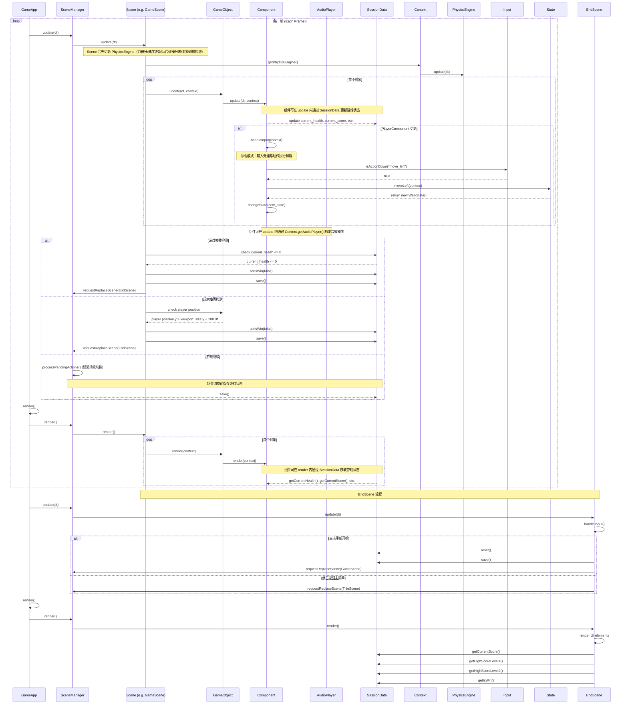

# 主循环调用流程 (Main Loop Sequence)

```mermaid
sequenceDiagram
    participant App as GameApp
    participant SM as SceneManager
    participant Scene as Scene (e.g. GameScene)
    participant GO as GameObject
    participant Comp as Component
    participant AP as AudioPlayer
    participant SD as SessionData

    loop 每一帧 (Each Frame)
        App->>SM: update(dt)
        SM->>Scene: update(dt)
        Note over Scene: Scene 会先更新 PhysicsEngine（力积分/速度更新/瓦片碰撞分离/对象碰撞检测）
        Scene->>Context: getPhysicsEngine()
        Context->>PhysicsEngine: update(dt)
        loop 每个对象
            Scene->>GO: update(dt, context)
            GO->>Comp: update(dt, context)
            Note over Comp,SD: 组件可在 update 内通过 SessionData 更新游戏状态
            Comp-->>SD: update current_health, current_score, etc.
            
            alt PlayerComponent 更新
                Comp->>Comp: handleInput(context)
                Note over Comp: 命令模式：输入处理与动作执行解耦
                Comp->>Input: isActionDown("move_left")
                Input-->>Comp: true
                Comp->>State: moveLeft(context)
                State-->>Comp: return new WalkState()
                Comp->>Comp: changeState(new_state)
            end
        end
        Note over Comp,AP: 组件可在 update 内通过 Context.getAudioPlayer() 触发音效播放
        
        alt 游戏失败检测
            Scene->>SD: check current_health <= 0
            SD-->>Scene: current_health <= 0
            Scene->>SD: setIsWin(false)
            Scene->>SD: save()
            Scene->>SM: requestReplaceScene(EndScene)
            
            else 玩家掉落检测
            Scene->>GO: check player position
            GO-->>Scene: player position.y > viewport_size.y + 100.0f
            Scene->>SD: setIsWin(false)
            Scene->>SD: save()
            Scene->>SM: requestReplaceScene(EndScene)
            
            else 游戏继续
            SM->>SM: processPendingActions() (延迟场景切换)
            Note over SM,SD: 场景切换前保存游戏状态
            SM-->>SD: save()
        end

        App->>App: render()
        App->>SM: render()
        SM->>Scene: render()
        loop 每个对象
            Scene->>GO: render(context)
            GO->>Comp: render(context)
            Note over Comp,SD: 组件可在 render 内通过 SessionData 获取游戏状态
            SD-->>Comp: getCurrentHealth(), getCurrentScore(), etc.
        end
    end

    Note over Scene,EndScene: EndScene 流程
    App->>SM: update(dt)
    SM->>EndScene: update(dt)
    EndScene->>EndScene: handleInput()
    
    alt 点击重新开始
        EndScene->>SD: reset()
        EndScene->>SD: save()
        EndScene->>SM: requestReplaceScene(GameScene)
    else 点击返回主菜单
        EndScene->>SM: requestReplaceScene(TitleScene)
    end
    
    App->>App: render()
    App->>SM: render()
    SM->>EndScene: render()
    EndScene->>EndScene: render UI elements
    EndScene->>SD: getCurrentScore()
    EndScene->>SD: getHighScoreLevel1()
    EndScene->>SD: getHighScoreLevel2()
    EndScene->>SD: getIsWin()
```