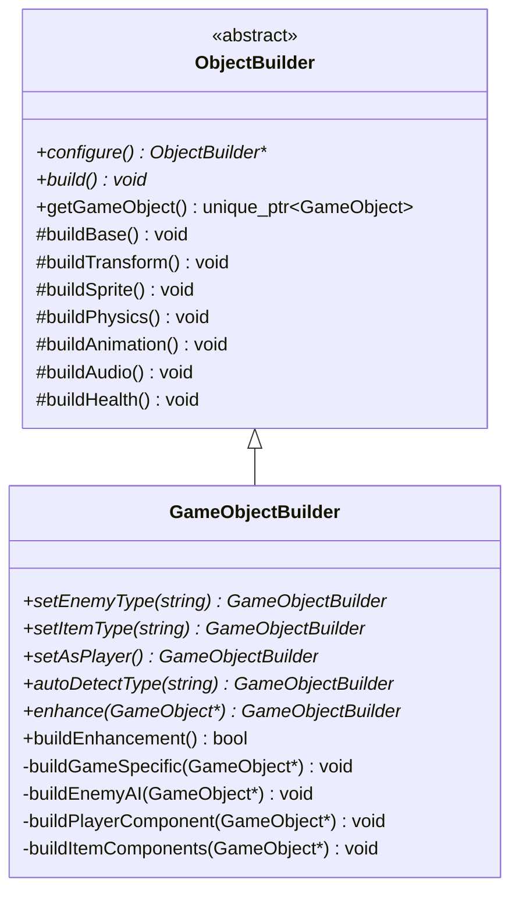

# 关键机制说明 (Key Mechanisms) - 第一部分

## 1. 场景管理 (Scene Management)
- **栈式管理**: 支持 `Push` (叠加场景，如暂停菜单) 和 `Replace` (切换场景，如转场)。
- **延迟操作**: 通过 `PendingAction` 确保在帧末尾进行场景切换，避免在更新循环中由于内存释放导致的悬空指针。
- **动态关卡加载**: `GameScene` 支持接收关卡路径参数，允许通过 `Replace` 操作实现不同关卡间的无缝切换。

## 2. 安全的对象添加/移除 (Safe Object Management)
- **safeAddGameObject**: 将对象加入 `pending_game_objects_`。
- **safeRemoveGameObject**: 标记对象为 `need_remove_`。
- 所有操作通过 `processPendingGameObjects` 在帧末尾统一处理，确保遍历容器时的迭代器安全性。

## 3. 精灵对齐与变换 (Sprite & Transform)
- `SpriteComponent` 会监听 `TransformComponent` 的缩放变化。
- **对齐方式 (Alignment)**: 支持 `CENTER`, `TOP_LEFT` 等，通过 `offset_` 实现局部偏移。

## 4. 资源共享机制 (Resource Management)
- **ResourceManager**: 内部持有 `TextureManager`, `FontManager`, `AudioManager`。
- **自动引用计数**: 同一个路径的资源只会被加载一次，通过 `std::shared_ptr` 管理贴图等重型资源的生命周期。

## 5. 音频系统 (Audio)

本项目实现了基于 `SDL3_mixer` 的音频子系统，用于统一处理 **背景音乐（BGM）** 与 **音效（SFX）** 的加载、缓存与播放。

### 组成与职责

- `engine::resource::AudioManager`
  - 负责初始化/关闭 `SDL3_mixer` 设备。
  - 采用懒加载 + 缓存：按文件路径缓存音频资源。
  - 内部分离两条轨道：`music_track_`（BGM）与 `sound_track_`（SFX）。
  - 提供音量控制方法。

- `engine::audio::AudioPlayer`
  - 面向“播放/控制”的高层封装，依赖 `ResourceManager` 间接访问 `AudioManager`。
  - 提供 master/sound/music 三种音量倍率，并在播放时统一应用。
  - 支持空间化音效：根据发声体与监听者的距离进行衰减。
  - 负责记录当前正在播放的 BGM，避免重复切歌。

- `engine::component::AudioComponent`
  - 轻量组件：将“动作/事件（action/id）”映射到音频资源路径。
  - 支持最小触发间隔节流，避免例如“走路/落地”事件被每帧触发造成爆音。
  - 支持通过相机作为监听点触发空间化音效。

### 调用链路（SFX 示例）

1) 业务/组件触发：`AudioComponent::playSound("jump", context)`

2) 组件通过 `context.getAudioPlayer()` 调用：`AudioPlayer::playSound(path)`

3) `AudioPlayer` 通过 `ResourceManager` 获取/复用音频资源并交给 `AudioManager` 播放

> 约定：音频路径与其他资源一致，均以项目根目录为相对基准（例如 `assets/sounds/jump.wav`）。

## 6. 动作映射系统 (Input Mapping)
- 键盘按键不直接对应逻辑，而是映射为 **Actions** (如 `"move_left"`, `"jump"`, `"move_up"`, `"move_down"`)。
- 在 `assets/config.json` 中配置按键绑定。

## 7. 生成器模式 (Builder Pattern)

本项目使用 **生成器模式** 构建复杂的游戏对象，将对象的构建过程与表示分离，支持灵活的对象配置。

### 架构组成



### 核心组件

#### ObjectBuilder (抽象生成器)
- **职责**: 定义构建游戏对象的通用步骤和接口
- **构建步骤**:
  1. `buildBase()`: 创建 GameObject 实例并设置名称
  2. `buildTransform()`: 解析位置、旋转、缩放信息
  3. `buildSprite()`: 根据图块信息创建精灵
  4. `buildPhysics()`: 根据类型创建碰撞器和物理组件
  5. `buildAnimation()`: 解析动画 JSON 配置
  6. `buildAudio()`: 解析音效 JSON 配置
  7. `buildHealth()`: 根据属性设置生命值

#### GameObjectBuilder (具体生成器)
- **职责**: 实现游戏特定对象的构建逻辑
- **扩展功能**:
  - 敌人 AI 行为构建 (`buildEnemyAI`)
  - 玩家组件构建 (`buildPlayerComponent`)
  - 道具组件构建 (`buildItemComponents`)

### 使用方式

#### 方式一：从头构建新对象

```cpp
GameObjectBuilder builder(level_loader, context);
auto enemy = builder
    .configure(&object_json, &tile_json, tile_info)
    .setEnemyType("eagle")
    .build()
    .getGameObject();
```

#### 方式二：增强已有对象

```cpp
GameObjectBuilder builder(level_loader, context);
builder.autoDetectType("frog")
       .enhance(existing_object)
       .buildEnhancement();
```

#### 方式三：自动类型检测

```cpp
GameObjectBuilder builder(level_loader, context);
auto game_object = builder
    .configure(&object_json, &tile_json, tile_info)
    .autoDetectType(object_name)  // 根据名称自动推断类型
    .build()
    .getGameObject();
```

### 支持的类型映射

| 名称 | 类型 | 添加的组件 |
|:---|:---|:---|
| "eagle" | 敌人 | AIComponent + UpDownBehavior |
| "frog" | 敌人 | AIComponent + JumpBehavior |
| "opossum" | 敌人 | AIComponent + PatrolBehavior |
| "player" | 玩家 | PlayerComponent + 状态机 |
| "fruit" | 道具 | 动画播放 + "item" 标签 |
| "gem" | 道具 | 动画播放 + "item" 标签 |

### 设计优势

1. **分步构建**: 将复杂对象的创建分解为多个步骤，每个步骤可以独立配置
2. **链式调用**: 支持流畅的 API 设计，提高代码可读性
3. **类型安全**: 通过 `unique_ptr` 管理对象所有权，避免内存泄漏
4. **可扩展性**: 新增对象类型只需在 `GameObjectBuilder` 中添加对应的构建逻辑
5. **复用性**: 增强模式允许为已有对象动态添加组件