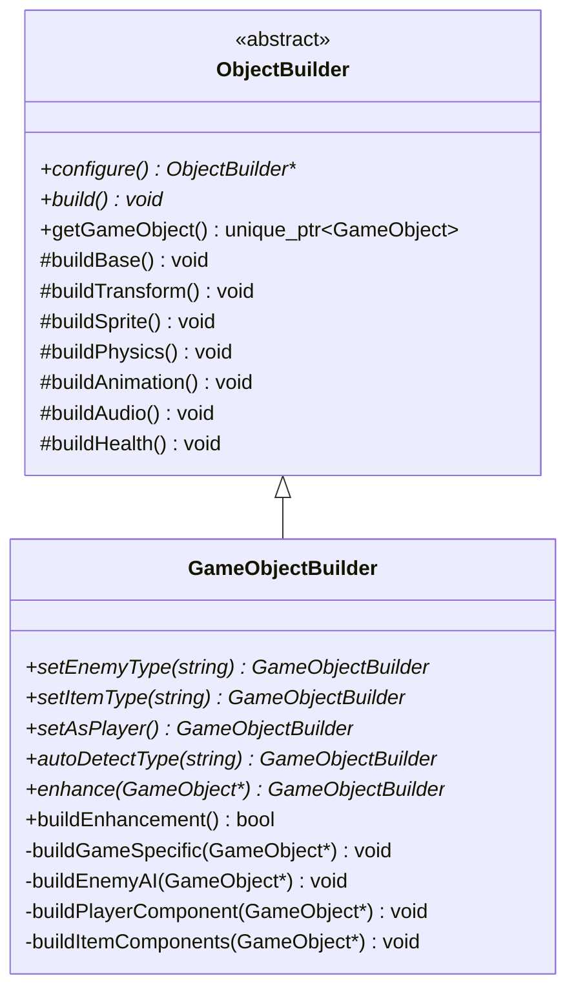
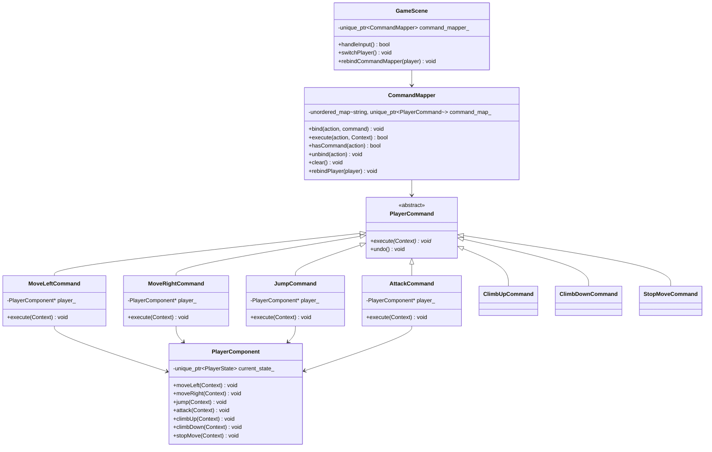
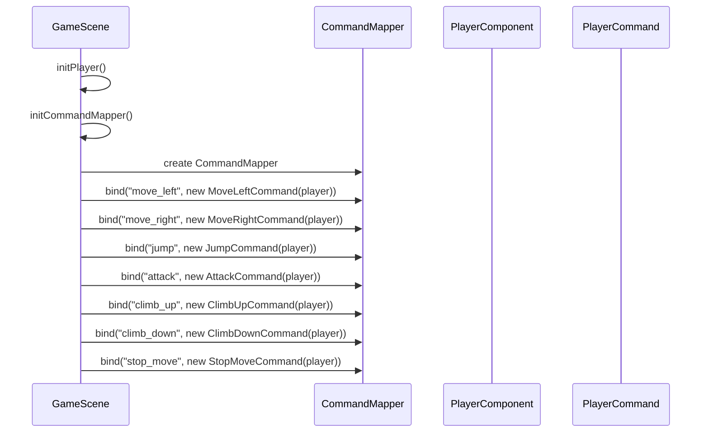
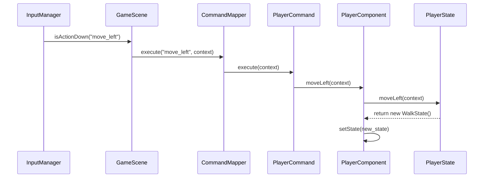
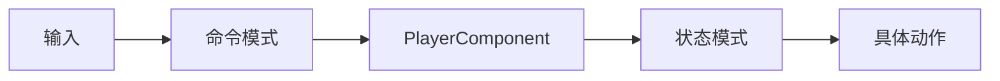
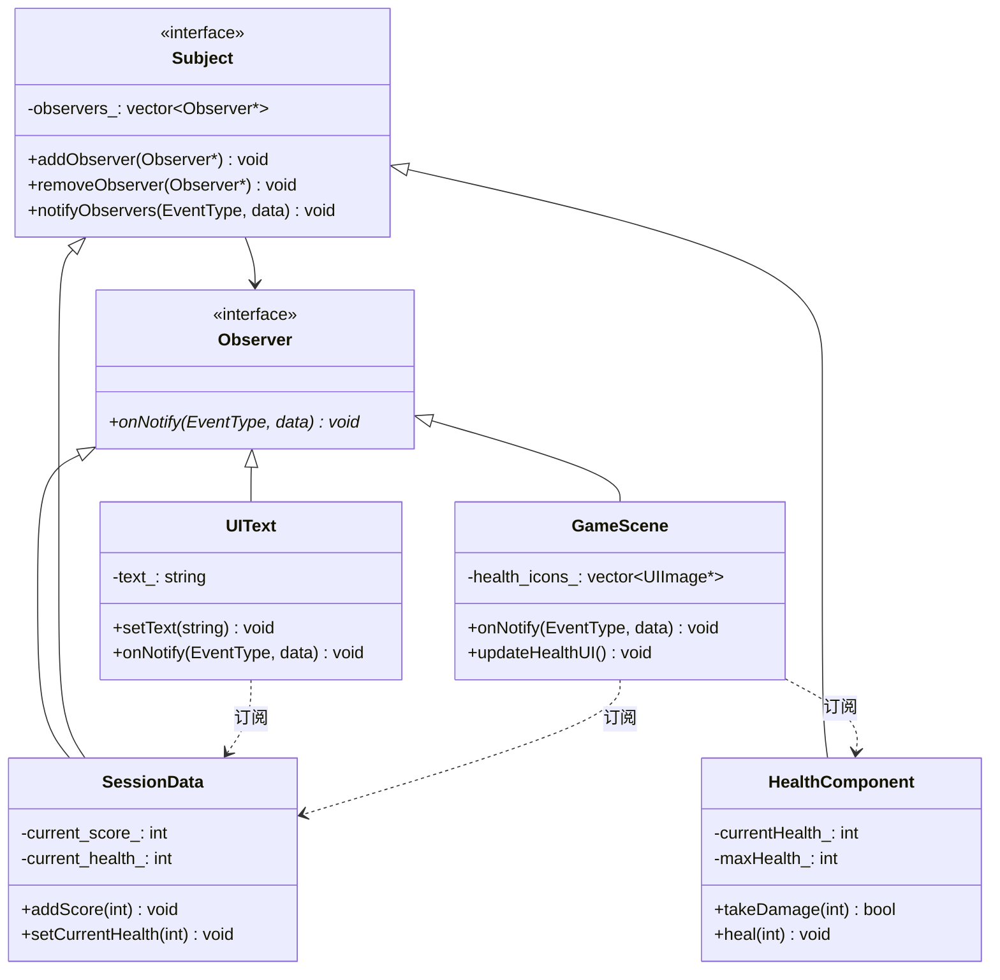
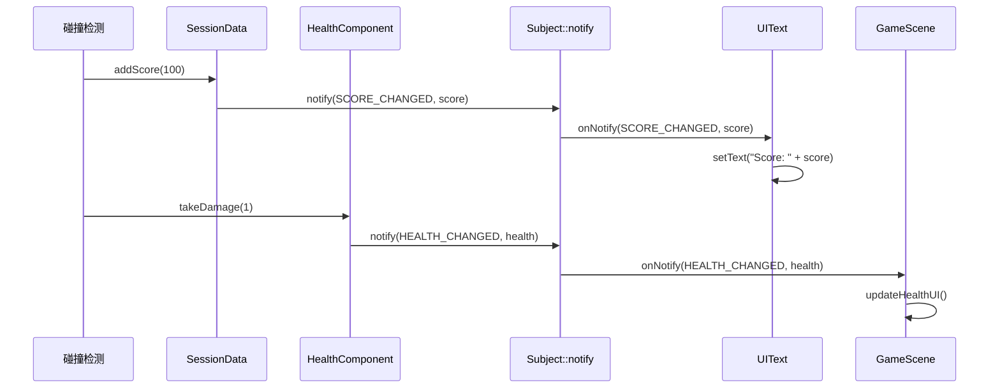
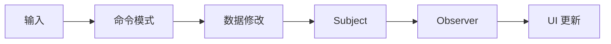

# 关键机制说明 (Key Mechanisms) - 第一部分

## 1. 场景管理 (Scene Management)
- **栈式管理**: 支持 `Push` (叠加场景，如暂停菜单) 和 `Replace` (切换场景，如转场)。
- **延迟操作**: 通过 `PendingAction` 确保在帧末尾进行场景切换，避免在更新循环中由于内存释放导致的悬空指针。
- **动态关卡加载**: `GameScene` 支持接收关卡路径参数，允许通过 `Replace` 操作实现不同关卡间的无缝切换。

## 2. 安全的对象添加/移除 (Safe Object Management)
- **safeAddGameObject**: 将对象加入 `pending_game_objects_`。
- **safeRemoveGameObject**: 标记对象为 `need_remove_`。
- 所有操作通过 `processPendingGameObjects` 在帧末尾统一处理，确保遍历容器时的迭代器安全性。

## 3. 精灵对齐与变换 (Sprite & Transform)
- `SpriteComponent` 会监听 `TransformComponent` 的缩放变化。
- **对齐方式 (Alignment)**: 支持 `CENTER`, `TOP_LEFT` 等，通过 `offset_` 实现局部偏移。

## 4. 资源共享机制 (Resource Management)
- **ResourceManager**: 内部持有 `TextureManager`, `FontManager`, `AudioManager`。
- **自动引用计数**: 同一个路径的资源只会被加载一次，通过 `std::shared_ptr` 管理贴图等重型资源的生命周期。

## 5. 音频系统 (Audio)

本项目实现了基于 `SDL3_mixer` 的音频子系统，用于统一处理 **背景音乐（BGM）** 与 **音效（SFX）** 的加载、缓存与播放。

### 组成与职责

- `engine::resource::AudioManager`
  - 负责初始化/关闭 `SDL3_mixer` 设备。
  - 采用懒加载 + 缓存：按文件路径缓存音频资源。
  - 内部分离两条轨道：`music_track_`（BGM）与 `sound_track_`（SFX）。
  - 提供音量控制方法。

- `engine::audio::AudioPlayer`
  - 面向“播放/控制”的高层封装，依赖 `ResourceManager` 间接访问 `AudioManager`。
  - 提供 master/sound/music 三种音量倍率，并在播放时统一应用。
  - 支持空间化音效：根据发声体与监听者的距离进行衰减。
  - 负责记录当前正在播放的 BGM，避免重复切歌。

- `engine::component::AudioComponent`
  - 轻量组件：将“动作/事件（action/id）”映射到音频资源路径。
  - 支持最小触发间隔节流，避免例如“走路/落地”事件被每帧触发造成爆音。
  - 支持通过相机作为监听点触发空间化音效。

### 调用链路（SFX 示例）

1) 业务/组件触发：`AudioComponent::playSound("jump", context)`

2) 组件通过 `context.getAudioPlayer()` 调用：`AudioPlayer::playSound(path)`

3) `AudioPlayer` 通过 `ResourceManager` 获取/复用音频资源并交给 `AudioManager` 播放

> 约定：音频路径与其他资源一致，均以项目根目录为相对基准（例如 `assets/sounds/jump.wav`）。

## 6. 动作映射系统 (Input Mapping)
- 键盘按键不直接对应逻辑，而是映射为 **Actions** (如 `"move_left"`, `"jump"`, `"move_up"`, `"move_down"`)。
- 在 `assets/config.json` 中配置按键绑定。

## 7. 生成器模式 (Builder Pattern)

本项目使用 **生成器模式** 构建复杂的游戏对象，将对象的构建过程与表示分离，支持灵活的对象配置。

### 架构组成



### 核心组件

#### ObjectBuilder (抽象生成器)
- **职责**: 定义构建游戏对象的通用步骤和接口
- **构建步骤**:
  1. `buildBase()`: 创建 GameObject 实例并设置名称
  2. `buildTransform()`: 解析位置、旋转、缩放信息
  3. `buildSprite()`: 根据图块信息创建精灵
  4. `buildPhysics()`: 根据类型创建碰撞器和物理组件
  5. `buildAnimation()`: 解析动画 JSON 配置
  6. `buildAudio()`: 解析音效 JSON 配置
  7. `buildHealth()`: 根据属性设置生命值

#### GameObjectBuilder (具体生成器)
- **职责**: 实现游戏特定对象的构建逻辑
- **扩展功能**:
  - 敌人 AI 行为构建 (`buildEnemyAI`)
  - 玩家组件构建 (`buildPlayerComponent`)
  - 道具组件构建 (`buildItemComponents`)

### 使用方式

#### 方式一：从头构建新对象

```cpp
GameObjectBuilder builder(level_loader, context);
auto enemy = builder
    .configure(&object_json, &tile_json, tile_info)
    .setEnemyType("eagle")
    .build()
    .getGameObject();
```

#### 方式二：增强已有对象

```cpp
GameObjectBuilder builder(level_loader, context);
builder.autoDetectType("frog")
       .enhance(existing_object)
       .buildEnhancement();
```

#### 方式三：自动类型检测

```cpp
GameObjectBuilder builder(level_loader, context);
auto game_object = builder
    .configure(&object_json, &tile_json, tile_info)
    .autoDetectType(object_name)  // 根据名称自动推断类型
    .build()
    .getGameObject();
```

### 支持的类型映射

| 名称 | 类型 | 添加的组件 |
|:---|:---|:---|
| "eagle" | 敌人 | AIComponent + UpDownBehavior |
| "frog" | 敌人 | AIComponent + JumpBehavior |
| "opossum" | 敌人 | AIComponent + PatrolBehavior |
| "player" | 玩家 | PlayerComponent + 状态机 |
| "fruit" | 道具 | 动画播放 + "item" 标签 |
| "gem" | 道具 | 动画播放 + "item" 标签 |

### 设计优势

1. **分步构建**: 将复杂对象的创建分解为多个步骤，每个步骤可以独立配置
2. **链式调用**: 支持流畅的 API 设计，提高代码可读性
3. **类型安全**: 通过 `unique_ptr` 管理对象所有权，避免内存泄漏
4. **可扩展性**: 新增对象类型只需在 `GameObjectBuilder` 中添加对应的构建逻辑
5. **复用性**: 增强模式允许为已有对象动态添加组件

## 8. 命令模式 (Command Pattern)

本项目使用 **命令模式** 解耦玩家输入处理与动作执行，实现灵活的动作控制系统。命令模式将请求封装为对象，使得可以用不同的请求、队列或日志来参数化其他对象，同时支持可撤销的操作。

### 8.1 架构概述



### 8.2 核心组件详解

#### 8.2.1 PlayerCommand (抽象命令)

**文件**: `src/game/command/player_commands.h`

```cpp
class PlayerCommand {
public:
    virtual ~PlayerCommand() = default;
    
    /**
     * @brief 执行命令
     * @param context 引擎上下文
     */
    virtual void execute(engine::core::Context& context) = 0;
    
    /**
     * @brief 撤销命令（可选）
     * @details 默认空实现，需要撤销功能的命令可重写
     */
    virtual void undo() {}
};
```

**设计要点**:
- 定义所有玩家命令的通用接口
- `execute()` 是纯虚函数，强制子类实现
- `undo()` 提供默认空实现，支持可选的撤销功能

#### 8.2.2 具体命令类

**文件**: `src/game/command/player_commands.h` / `player_commands.cpp`

所有具体命令类遵循相同的模式：

```cpp
class MoveLeftCommand : public PlayerCommand {
    game::component::PlayerComponent* player_;
public:
    explicit MoveLeftCommand(game::component::PlayerComponent* player) : player_(player) {}
    void execute(engine::core::Context& context) override;
};

void MoveLeftCommand::execute(engine::core::Context& context) {
    if (player_) {
        player_->moveLeft(context);
    }
}
```

**支持的命令列表**:

| 命令类 | 功能 | 调用的 PlayerComponent 方法 |
|:---|:---|:---|
| `MoveLeftCommand` | 向左移动 | `moveLeft(context)` |
| `MoveRightCommand` | 向右移动 | `moveRight(context)` |
| `JumpCommand` | 跳跃 | `jump(context)` |
| `AttackCommand` | 攻击 | `attack(context)` |
| `ClimbUpCommand` | 向上攀爬 | `climbUp(context)` |
| `ClimbDownCommand` | 向下攀爬 | `climbDown(context)` |
| `StopMoveCommand` | 停止移动 | `stopMove(context)` |

**设计要点**:
- 每个命令类持有 `PlayerComponent` 指针作为接收者
- 命令执行时调用接收者的相应方法
- 空指针检查确保安全性

#### 8.2.3 CommandMapper (命令映射器)

**文件**: `src/game/command/command_mapper.h` / `command_mapper.cpp`

```cpp
class CommandMapper {
public:
    void bind(const std::string& action, std::unique_ptr<PlayerCommand> command);
    bool execute(const std::string& action, engine::core::Context& context);
    bool hasCommand(const std::string& action) const;
    void unbind(const std::string& action);
    void clear();
    void rebindPlayer(game::component::PlayerComponent* player);

private:
    std::unordered_map<std::string, std::unique_ptr<PlayerCommand>> command_map_;
};
```

**方法说明**:

| 方法 | 功能 | 使用场景 |
|:---|:---|:---|
| `bind()` | 将动作名称绑定到命令对象 | 初始化时配置命令映射 |
| `execute()` | 执行指定动作对应的命令 | 输入处理时调用 |
| `hasCommand()` | 检查动作是否已绑定 | 验证命令是否存在 |
| `unbind()` | 解除动作绑定 | 动态移除命令 |
| `clear()` | 清除所有绑定 | 重置或切换玩家时 |
| `rebindPlayer()` | 重新绑定玩家（用于双人模式） | 切换控制目标时 |

**实现细节**:

```cpp
void CommandMapper::bind(const std::string& action, std::unique_ptr<PlayerCommand> command) {
    if (command) {
        command_map_[action] = std::move(command);
    }
}

bool CommandMapper::execute(const std::string& action, engine::core::Context& context) {
    auto it = command_map_.find(action);
    if (it != command_map_.end() && it->second) {
        it->second->execute(context);
        return true;
    }
    return false;
}
```

#### 8.2.4 PlayerComponent (接收者)

**文件**: `src/game/component/player_component.h` / `player_component.cpp`

PlayerComponent 提供动作接口供命令调用：

```cpp
class PlayerComponent : public engine::component::Component {
public:
    // 动作接口（供命令模式调用）
    void moveLeft(engine::core::Context& context);
    void moveRight(engine::core::Context& context);
    void jump(engine::core::Context& context);
    void attack(engine::core::Context& context);
    void climbUp(engine::core::Context& context);
    void climbDown(engine::core::Context& context);
    void stopMove(engine::core::Context& context);

private:
    std::unique_ptr<state::PlayerState> current_state_;
};
```

**动作实现模式**:

```cpp
void PlayerComponent::moveLeft(engine::core::Context& context) {
    if (!current_state_) return;
    auto new_state = current_state_->moveLeft(context);
    if (new_state) {
        setState(std::move(new_state));
    }
}
```

**设计要点**:
- 动作方法委托给当前状态处理
- 状态可能返回新状态，触发状态切换
- 与状态模式结合，实现状态相关的动作响应

### 8.3 工作流程

#### 8.3.1 初始化流程



#### 8.3.2 输入处理流程



### 8.4 使用示例

#### 8.4.1 基本使用

```cpp
// GameScene::initCommandMapper()
void GameScene::initCommandMapper() {
    command_mapper_ = std::make_unique<game::command::CommandMapper>();

    // 绑定动作到命令
    command_mapper_->bind("move_left", 
        std::make_unique<game::command::MoveLeftCommand>(player_component_));
    command_mapper_->bind("move_right", 
        std::make_unique<game::command::MoveRightCommand>(player_component_));
    command_mapper_->bind("jump", 
        std::make_unique<game::command::JumpCommand>(player_component_));
    command_mapper_->bind("attack", 
        std::make_unique<game::command::AttackCommand>(player_component_));
    command_mapper_->bind("climb_up", 
        std::make_unique<game::command::ClimbUpCommand>(player_component_));
    command_mapper_->bind("climb_down", 
        std::make_unique<game::command::ClimbDownCommand>(player_component_));
    command_mapper_->bind("stop_move", 
        std::make_unique<game::command::StopMoveCommand>(player_component_));
}
```

#### 8.4.2 输入处理

```cpp
// GameScene::handleInput()
bool GameScene::handleInput() {
    Scene::handleInput();
    auto& input_manager = context_.getInputManager();

    // 处理移动输入
    if (input_manager.isActionDown("move_left")) {
        command_mapper_->execute("move_left", context_);
    }
    else if (input_manager.isActionDown("move_right")) {
        command_mapper_->execute("move_right", context_);
    }
    else {
        command_mapper_->execute("stop_move", context_);
    }

    // 处理跳跃输入（按下触发）
    if (input_manager.isActionPressed("jump")) {
        command_mapper_->execute("jump", context_);
    }

    // 处理攻击输入（按下触发）
    if (input_manager.isActionPressed("attack")) {
        command_mapper_->execute("attack", context_);
    }

    return true;
}
```

### 8.5 双人模式支持

命令模式的解耦特性使得实现双人控制切换变得非常简单：

```cpp
void GameScene::switchPlayer() {
    // 查找第二个玩家
    auto* player2 = findGameObjectByName("player2");
    if (!player2) return;

    // 切换当前控制玩家
    current_controlled_player_ = (current_controlled_player_ == player_) 
        ? player2 : player_;

    // 切换相机跟随
    auto* transform = current_controlled_player_->getComponent<TransformComponent>();
    context_.getCamera().setTarget(transform);

    // 重新绑定命令到新玩家
    auto* new_player_component = current_controlled_player_
        ->getComponent<game::component::PlayerComponent>();
    if (new_player_component) {
        rebindCommandMapper(new_player_component);
    }
}

void GameScene::rebindCommandMapper(game::component::PlayerComponent* player_component) {
    command_mapper_->clear();
    
    command_mapper_->bind("move_left", 
        std::make_unique<game::command::MoveLeftCommand>(player_component));
    command_mapper_->bind("move_right", 
        std::make_unique<game::command::MoveRightCommand>(player_component));
    // ... 其他命令
}
```

### 8.6 设计优势

1. **解耦输入与动作**: 输入处理代码与动作执行代码分离，便于独立修改
2. **支持宏命令**: 可以将多个命令组合成一个复合命令
3. **支持撤销/重做**: 通过 `undo()` 方法可以实现撤销功能
4. **支持日志记录**: 可以记录命令历史用于回放或调试
5. **支持双人切换**: 通过重新绑定命令对象，轻松实现控制切换
6. **易于扩展**: 新增动作只需添加新的命令类

### 8.7 与状态模式的协作

命令模式和状态模式在本项目中紧密协作：



- **命令模式**: 负责解耦输入处理，决定"做什么"
- **状态模式**: 负责根据当前状态决定"怎么做"

这种分层设计使得系统既灵活又可维护。

### 设计优势

1. **解耦**: 输入处理与动作执行完全分离
2. **灵活性**: 不同状态可以有不同的动作响应
3. **可扩展性**: 新增动作只需在基类添加接口，在相关状态实现
4. **可维护性**: 动作逻辑集中在状态类中，易于理解和修改
5. **状态安全**: 状态类自主决定支持哪些动作，防止非法状态转换

## 9. 观察者模式 (Observer Pattern)

本项目使用 **观察者模式** 解耦数据变化与 UI 更新，实现响应式的数据驱动 UI 系统。

### 9.1 架构概述



### 9.2 核心组件详解

#### 9.2.1 Observer 接口

**文件**: `src/engine/interface/observer.h`

```cpp
enum class EventType {
    HEALTH_CHANGED,
    MAX_HEALTH_CHANGED,
    SCORE_CHANGED,
};

class Observer {
public:
    virtual ~Observer() = default;
    virtual void onNotify(EventType event_type, const std::any& data) = 0;
};
```

#### 9.2.2 Subject 接口

**文件**: `src/engine/interface/subject.h`

```cpp
class Subject {
    std::vector<Observer*> observers_;
public:
    virtual ~Subject();
    
    void addObserver(Observer* observer);
    void removeObserver(Observer* observer);
    void clearObservers();
    
protected:
    void notifyObservers(const EventType& event, const std::any& data);
};
```

**说明**:
- `notifyObservers()` 是受保护方法，供子类在状态变化时调用
- 实现了双向引用安全机制：Subject 和 Observer 互相持有引用，析构时自动解除
- 使用 `std::any` 传递事件数据，支持任意类型

#### 9.2.3 具体 Subject 实现

**SessionData** (`src/game/data/session_data.h/cpp`):

```cpp
class SessionData : public engine::interface::Subject, public engine::interface::Observer {
    void addScore(int score) {
        if (score > 0) {
            current_score_ += score;
            updateHighScore();
            // 通知观察者分数变化
            notifyObservers(engine::interface::EventType::SCORE_CHANGED, current_score_);
        }
    }
    
    void onNotify(engine::interface::EventType event_type, const std::any& data) override {
        if (event_type == engine::interface::EventType::HEALTH_CHANGED) {
            int health = std::any_cast<int>(data);
            setCurrentHealth(health);
        }
        else if (event_type == engine::interface::EventType::MAX_HEALTH_CHANGED) {
            int max_health = std::any_cast<int>(data);
            setMaxHealth(max_health);
        }
    }
};
```

**HealthComponent** (`src/engine/component/health_component.h/cpp`):

```cpp
class HealthComponent : public Component, public engine::interface::Subject {
    bool takeDamage(int damage) {
        if (damage <= 0 || !isAlive() || isInvincible()) return false;
        currentHealth_ -= damage;
        currentHealth_ = glm::max(0, currentHealth_);
        // 通知观察者生命值变化
        notifyObservers(engine::interface::EventType::HEALTH_CHANGED, currentHealth_);
        return true;
    }
    
    void heal(int amount) {
        if (amount <= 0 || !isAlive()) return;
        currentHealth_ += amount;
        currentHealth_ = glm::min(currentHealth_, maxHealth_);
        // 通知观察者生命值变化
        notifyObservers(engine::interface::EventType::HEALTH_CHANGED, currentHealth_);
    }
    
    void setMaxHealth(int maxHealth) {
        maxHealth_ = maxHealth;
        if (currentHealth_ > maxHealth_) {
            currentHealth_ = maxHealth_;
        }
        // 通知观察者最大生命值变化
        notifyObservers(engine::interface::EventType::MAX_HEALTH_CHANGED, maxHealth_);
    }
};
```

#### 9.2.4 具体 Observer 实现

**UIText** (`src/engine/ui/ui_text.h/cpp`):

```cpp
class UIText : public UIElement, public engine::interface::Observer {
    void onNotify(engine::interface::EventType event_type, const std::any& data) override {
        if (event_type == engine::interface::EventType::SCORE_CHANGED) {
            if (const int* score = std::any_cast<int>(&data)) {
                setText("Score: " + std::to_string(*score));
                updateSize();
            }
        }
    }
};
```

**GameScene** (`src/game/scene/game_scene.h/cpp`):

```cpp
class GameScene : public engine::scene::Scene, public engine::interface::Observer {
    void onNotify(engine::interface::EventType event_type, const std::any& data) override {
        switch (event_type) {
            case engine::interface::EventType::HEALTH_CHANGED:
                if (const int* health = std::any_cast<int>(&data)) {
                    session_data_->setCurrentHealth(*health);
                    updateHealthUI();
                }
                break;
            case engine::interface::EventType::MAX_HEALTH_CHANGED:
                initHealthIcons();
                break;
        }
    }
    
    void updateHealthUI() {
        int current_health = session_data_->getCurrentHealth();
        for (size_t i = 0; i < health_icons_.size(); ++i) {
            if (health_icons_[i]) {
                health_icons_[i]->setVisible(i < current_health);
            }
        }
    }
};
```

### 9.3 工作流程

#### 9.3.1 建立订阅关系

```cpp
void GameScene::initHUD() {
    // 创建 UI 元素...
    score_text_ = score_text.get();
    
    // 建立观察者订阅关系
    if (session_data_ && score_text_) {
        session_data_->addObserver(score_text_);
    }
}

bool GameScene::initPlayer() {
    // 初始化玩家...
    
    // GameScene 订阅 HealthComponent 的生命值变化
    if (auto* health_component = player_->getComponent<HealthComponent>()) {
        health_component->addObserver(this);
    }
}
```

#### 9.3.2 数据变化通知流程



### 9.4 使用示例

#### 9.4.1 分数更新（自动 UI 更新）

```cpp
// 旧方式：手动更新数据和 UI
session_data_->addScore(100);
updateHUD();  // 手动调用

// 新方式：只更新数据，UI 自动响应
session_data_->addScore(100);  // UIText 自动更新显示
```

#### 9.4.2 生命值更新（自动 UI 更新）

```cpp
// 玩家受伤
player->takeDamage(1);  // GameScene 自动更新生命值图标

// 玩家回血
player->heal(1);  // GameScene 自动更新生命值图标
```

### 9.5 生命周期管理

```cpp
void GameScene::clean() {
    // 取消观察者订阅，避免悬垂指针
    if (session_data_ && score_text_) {
        session_data_->removeObserver(score_text_);
    }
    
    if (player_) {
        if (auto* health_component = player_->getComponent<HealthComponent>()) {
            health_component->removeObserver(this);
        }
    }
    
    Scene::clean();
}
```

### 9.6 设计优势

1. **松耦合**: 数据源不需要知道 UI 的存在，UI 也不需要知道数据源的内部实现
2. **自动更新**: 数据变化自动触发 UI 更新，无需手动调用
3. **一对多**: 一个数据源可以被多个观察者订阅
4. **可扩展**: 新增观察者只需实现 Observer 接口并订阅
5. **可维护**: UI 更新逻辑集中在各自的 onNotify 方法中

### 9.7 与命令模式的协作

观察者模式和命令模式共同构成本项目的响应式架构：



- **命令模式**: 处理用户输入，触发数据修改
- **观察者模式**: 监听数据变化，自动更新 UI

这种架构实现了完整的 **数据驱动 UI** 模式。