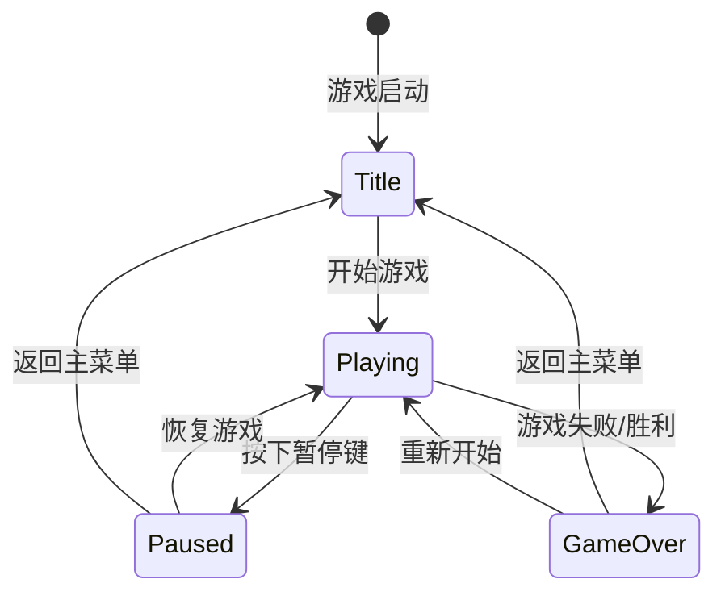

# 关键机制说明 (Key Mechanisms) - 第二部分

## 7. 关卡加载 (Level Loading)
- **从 Tiled 导入**: 使用 `LevelLoader` 解析 Tiled 编辑器导出的 JSON 格式 (`.tmj`) 地图。
- **图块集支持**: 支持解析外部Tileset (`.tsj`)，包括大图 (`Image Collection`) 和单图集 (`Image`) 模式。
- **图层解析**: 
    - `Image Layer` -> `ParallaxComponent` (支持部分滚动因子，用于远景)。
    - `Tile Layer` -> `TileLayerComponent` (支持剔除渲染与对齐修正)。
        - **物理类型支持**: 支持 `SOLID` (碰撞)、`HAZARD` (伤害区域)、`LADDER` (可攀爬区域) 以及多种角度的 `SLOPE` (斜坡)。
    - `Object Layer`:
        - **视觉对象**: 将带 GID 的对象实例化为带 `Transform`, `Sprite` 组件的实体。
        - **形状对象 (GID=0)**: 支持加载矩形等形状，自动附加 `ColliderComponent` (触发器) 与静态 `PhysicsComponent`，用于实现关卡出口、检查点等逻辑触发区域。
- **路径解析**: 自动处理相对路径，确保纹理资源正确加载。

## 8. 视差滚动 (Parallax Scrolling)
- **ParallaxComponent**: 专门负责渲染背景图层的组件。
- **视差因子 (Factor)**: 通过 `parallax_factor_` 控制背景随相机移动的速度（例如 `0.2` 表示背景移动速度是相机的 0.2 倍，产生远景效果）。
- **Offset 支持**: 正确处理 Tiled 中的 `offsetx/offsety` 偏移量。

## 9. 动画系统 (Animation System)
- **基于时间的播放**: 动画逻辑与帧率无关。`AnimationComponent` 通过累计 `delta_time` 并在 `Animation` 对象中检索对应时刻的 `AnimationFrame`。
- **循环控制**: 
    - 循环动画使用 `fmod` 处理溢出时间，确保循环逻辑无漂移。
    - 非循环动画在到达 `total_duration` 后会自动停止并锁定在最后一帧，避免出现闪烁回到第一帧的 Bug。
- **数据驱动**: 动画数据可以直接定义在 Tiled 的 Tileset 属性中（JSON 字符串格式），由 `LevelLoader` 自动解析并挂载。
- **与 Sprite 交互**: `AnimationComponent` 每帧计算出当前的 `src_rect` 后，直接调用 `SpriteComponent::setSourceRect()` 更新渲染内容。

## 10. 物理系统 (Physics)

- **PhysicsEngine**: 维护所有 `PhysicsComponent` 的注册列表，并在每帧统一调用 `update(dt)`。
- **PhysicsComponent**: 作为组件挂载到 `GameObject` 上，内部持有速度、受力、质量等数据，并在 `init/clean` 时向 `PhysicsEngine` 注册/注销。

### 更新顺序

- 当前引擎实现中，`Scene::update(dt)` 会最先调用 `context_.getPhysicsEngine().update(dt)`，随后再更新每个 `GameObject` 的逻辑组件。

### 单位约定

- `Time::getDeltaTime()` 输出单位为 **秒 (s)**。
- `PhysicsEngine` 内的 `gravity_` 以 **像素/秒²** 表示（默认约 `980`）。
- `PhysicsComponent::velocity_` 以 **像素/秒** 表示。

### 当前限制（后续可扩展）

- 目前已实现 **基础碰撞检测**：`PhysicsEngine` 在 `update(dt)` 末尾执行 `checkObjectCollisions()`，对注册的物理对象两两检测碰撞。
- 碰撞基于 `ColliderComponent` + `engine::physics::collision::checkCollision()`：
  - 先做世界坐标 AABB 粗检（broad-phase）
  - 通过碰撞体类型再做细检（narrow-phase）：AABB/AABB、Circle/Circle、AABB/Circle
- 检测结果会写入 `PhysicsEngine::collision_pairs_`，并可通过 `PhysicsEngine::getCollisionPairs()` 读取（用于调试/测试）。

### 玩家掉落检测

- **实现位置**：在 `GameScene::update()` 方法中实现
- **检测逻辑**：检查玩家位置是否超出屏幕下方 100 像素
- **处理流程**：
  1. 获取玩家当前位置
  2. 获取视口大小
  3. 检查玩家位置.y 是否大于视口大小.y + 100.0f
  4. 如果超出，设置游戏失败状态，保存游戏数据，切换到结束场景
- **阈值设置**：100 像素的缓冲区，避免玩家因轻微超出屏幕就触发游戏失败

此外已实现 **瓦片碰撞分离（Tile collision resolve）**：

- `PhysicsEngine::update(dt)` 在对每个 `PhysicsComponent` 积分速度后调用 `resolveTileCollisions(pc, dt)`。
- `resolveTileCollisions()` 会根据物体的 `ColliderComponent` 世界 AABB 与 `TileLayerComponent` 的 SOLID 瓦片进行分离：
  - 采用 **分离轴 sweep**（先 X 后 Y）避免角落处左右方向表现不一致。
  - 采用对称 `eps`（很小值）对 AABB 边界向内缩，避免 `floor()` 带来的左右/上下取整不对称。
  - **斜坡物理增强**:
    - **自动吸附 (Snap/Stickiness)**: 在 `resolveYAxisCollision` 中实现了吸附逻辑，允许玩家在走下坡时保持贴地，避免因重力积分滞后导致的脱离地面和状态闪烁。
    - **即时状态更新**: 在水平移动（X轴）发生斜坡修正时，立即更新 `collided_below_` 标志，确保后续逻辑（如下一帧的初速度判定）正确。
    - **判定鲁棒性**: 选取检测范围内 Y 值最小（即物理高度最高）的斜坡面作为支撑面，彻底消除多重碰撞重叠时的“弹出”Bug。
    - **吸附禁用 (Snap Suppression)**: 提供的 `suppressSnapFor(seconds)` 方法允许状态机在起跳或特殊切出时暂时禁用吸附逻辑，防止被 Stickiness 拉回斜坡。
  - **梯子中心对齐**: 在进入攀爬（尤其是从上方边缘下落进入）时，引擎会自动计算梯子列的中心 X 坐标并将玩家吸附过去，确保动画展现的对齐。
  - 采样瓦片坐标时使用与 `TileLayerComponent::getTileTypeAtWorldPos()` 一致的世界偏移：`layer->getOffset() + layer_owner->Transform.position`，避免渲染与碰撞坐标系不一致。
  - 发生碰撞时将对应轴速度分量置零（例如撞墙清零 `velocity_.x`，落地清零 `velocity_.y`）。

## 每个场景的独特系统 (Scene Specific Systems)

### 1. 相机平滑跟随 (Smooth Camera Follow)
- **目标绑定**: `Camera` 支持绑定一个 `TransformComponent` 作为 `target_`。
- **平滑插值**: 使用 `glm::mix` (Lerp) 实现基于时间的平滑位移，计算公式为 `current = mix(current, target, factor * dt)`，有效滤除角色快速运动引起的视觉抖动。
- **边界约束**: 使用 `clampPosition` 确保相机不会露出地图黑边。

### 调试用例（GameScene）

`game::scene::GameScene` 内置了一个简单的碰撞测试用例（便于快速验证碰撞检测链路）：

- `test_object`：受重力影响的箱子，带 `AABBCollider(32x32)`
- `test_object2`：静止物体，不受重力，带 `CircleCollider(radius=16)`

在 `GameScene::update()` 中会调用 `TestCollisionPairs()`，每帧遍历并打印 `PhysicsEngine::getCollisionPairs()`。

## 11. 游戏状态管理 (GameState)

`GameState` 类负责管理游戏的全局状态，包括游戏运行状态、窗口尺寸等信息。

### 状态类型

```cpp
enum class GameStateType {
    Title,      // 标题场景
    Playing,    // 游戏进行中
    Paused,     // 游戏暂停
    GameOver,   // 游戏结束
};
```

### 核心功能

#### 状态管理
- `getState()`: 获取当前游戏状态
- `setState(GameStateType)`: 设置游戏状态
- `isPlaying()`: 检查是否处于游戏进行中状态
- `isPaused()`: 检查是否处于暂停状态
- `isGameOver()`: 检查是否处于游戏结束状态

#### 窗口管理
- `getWindowSize()`: 获取窗口物理尺寸（像素）
- `setWindowSize(vec2)`: 设置窗口物理尺寸
- `getWindowLogicalSize()`: 获取窗口逻辑尺寸（用于渲染坐标系）
- `setWindowLogicalSize(vec2)`: 设置窗口逻辑尺寸

### 状态转换流程



### 使用场景

1. **场景切换控制**: `SceneManager` 根据 `GameState` 决定是否处理场景更新
2. **输入响应**: `InputManager` 根据状态决定如何处理输入（如暂停时忽略游戏输入）
3. **UI 显示**: UI 系统根据状态显示不同的界面（暂停菜单、游戏结束画面等）
4. **窗口管理**: 提供统一的窗口尺寸查询接口，支持不同分辨率的适配