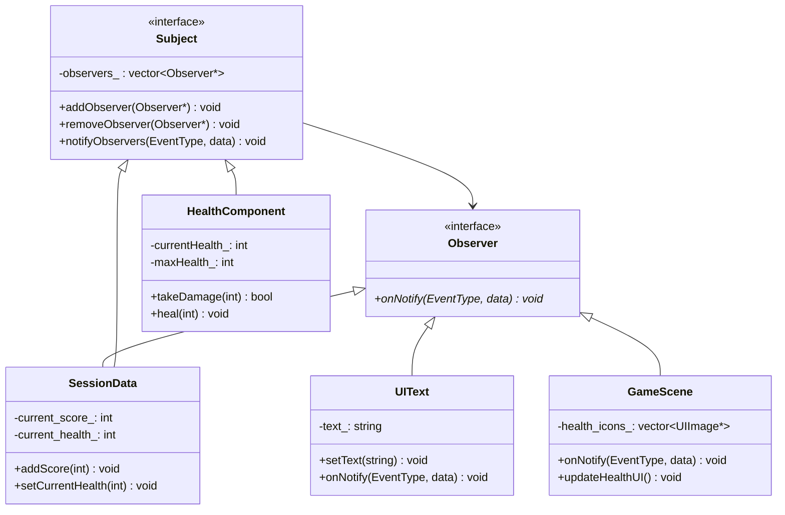

# 关键机制说明 (Key Mechanisms) - 第四部分

## 20. 观察者模式实现细节 (Observer Pattern Implementation)

本项目使用 **观察者模式** 解耦数据变化与 UI 更新，实现响应式的数据驱动 UI 系统。

### 架构组成



### 事件类型定义

```cpp
enum class EventType {
    HEALTH_CHANGED,      // 生命值变化
    MAX_HEALTH_CHANGED,  // 最大生命值变化
    SCORE_CHANGED,       // 分数变化
};
```

### 核心接口

**Observer 接口** (`src/engine/interface/observer.h`):
```cpp
class Observer {
public:
    virtual ~Observer() = default;
    virtual void onNotify(EventType event_type, const std::any& data) = 0;
};
```

**Subject 接口** (`src/engine/interface/subject.h`):
```cpp
class Subject {
    std::vector<Observer*> observers_;
public:
    virtual ~Subject();
    void addObserver(Observer* observer);
    void removeObserver(Observer* observer);
    void clearObservers();
protected:
    void notifyObservers(const EventType& event, const std::any& data);
};
```

### 使用示例

**数据变化通知**:
```cpp
// SessionData 中通知分数变化
void SessionData::addScore(int score) {
    if (score > 0) {
        current_score_ += score;
        // 通知观察者
        notifyObservers(EventType::SCORE_CHANGED, current_score_);
    }
}

// HealthComponent 中通知生命值变化
bool HealthComponent::takeDamage(int damage) {
    if (damage <= 0 || !isAlive() || isInvincible()) return false;
    currentHealth_ -= damage;
    // 通知观察者
    notifyObservers(EventType::HEALTH_CHANGED, currentHealth_);
    return true;
}
```

**UI 响应更新**:
```cpp
// UIText 实现 Observer 接口
class UIText : public UIElement, public Observer {
    void onNotify(EventType event_type, const std::any& data) override {
        if (event_type == EventType::SCORE_CHANGED) {
            if (const int* score = std::any_cast<int>(&data)) {
                setText("Score: " + std::to_string(*score));
                updateSize();
            }
        }
    }
};

// GameScene 实现 Observer 接口
class GameScene : public Scene, public Observer {
    void onNotify(EventType event_type, const std::any& data) override {
        switch (event_type) {
            case EventType::HEALTH_CHANGED:
                updateHealthUI();
                break;
            case EventType::MAX_HEALTH_CHANGED:
                initHealthIcons();
                break;
        }
    }
};
```

**建立订阅关系**:
```cpp
void GameScene::initHUD() {
    // 创建 UI 元素
    auto score_text = std::make_unique<UIText>(...);
    score_text_ = score_text.get();
    
    // 订阅 SessionData 的分数变化
    if (session_data_ && score_text_) {
        session_data_->addObserver(score_text_);
    }
}

void GameScene::initPlayer() {
    // 订阅 HealthComponent 的生命值变化
    if (auto* health_component = player_->getComponent<HealthComponent>()) {
        health_component->addObserver(this);
    }
}
```

**生命周期管理**:
```cpp
void GameScene::clean() {
    // 取消订阅，避免悬垂指针
    if (session_data_ && score_text_) {
        session_data_->removeObserver(score_text_);
    }
    if (player_) {
        if (auto* health_component = player_->getComponent<HealthComponent>()) {
            health_component->removeObserver(this);
        }
    }
    Scene::clean();
}
```

### 设计优势

1. **松耦合**: 数据源不需要知道 UI 的存在
2. **自动更新**: 数据变化自动触发 UI 更新
3. **一对多**: 一个数据源可以被多个观察者订阅
4. **可扩展**: 新增观察者只需实现 Observer 接口

---

## 21. 关卡切换逻辑与数据存储 (Level Switching & Data Storage)

### 关卡切换 (Level Switching)
- **触发器设计**: 在 Tiled 中放置 `tag` 为 `next_level` 的对象。
- **自动跳转**: `GameScene` 碰撞处理器检测到玩家进入触发区时，提取对象的 `name` 作为目标地图文件名。
- **流程**: 检测碰撞 -> 拼接路径 -> 保存游戏状态 -> `requestReplaceScene` -> 帧末自动销毁旧场景并加载新关卡。

### 数据存储 (Session Data)
- **SessionData 类**: 独立的游戏状态管理类，采用单例模式实现全局访问。使用 `std::weak_ptr` 存储单例实例，通过 `getInstance()` 返回 `std::shared_ptr` 确保线程安全和生命周期管理。
- **存储内容**: 玩家生命值、最大生命值、当前得分、最高分、当前关卡路径、游戏胜利/失败状态等。
- **数据持久化**: 使用 `nlohmann/json` 库实现游戏数据的 JSON 序列化/反序列化，支持存档和读档功能。
- **场景间共享**: 通过 `std::shared_ptr` 在场景间共享数据，生命周期独立于场景。
- **SceneManager 集成**: 扩展 `SceneManager` 以管理 `SessionData`，实现场景切换时的数据传递与持久化。
- **手动保存**: 支持通过按下 K 键手动保存游戏数据。
- **游戏状态管理**: 管理游戏胜利/失败状态，用于结束场景的显示。
- **关卡切换保存**: 提供 `prepareToSaveData()` 和 `cancelSaveData()` 方法控制关卡切换时的数据保存行为。

## 21. 计分系统 (Scoring System)

本项目实现了一个完整的计分系统，用于跟踪玩家的游戏得分。

### 核心功能
- **得分来源**:
  - 踩踏敌人: 每个敌人踩踏得分 50 分
  - 收集物品: 每个物品收集得分 100 分
- **得分管理**: 通过 `SessionData` 类统一管理游戏得分，支持得分的增加、获取和持久化存储。
- **得分显示**: 在游戏 HUD 中通过 `UIText` 控件实时显示当前得分，位置固定在屏幕右上角。
- **最高分系统**: 实现了各关卡最高分的记录和保存，每次得分大于当前关卡最高分时自动更新。

### 实现细节
- **碰撞检测**: 在 `GameScene::PlayerVSEnemyCollision` 中实现敌人踩踏检测，当玩家从上方踩踏敌人时触发得分。
- **得分逻辑**: 敌人被踩踏并消灭后，自动增加对应得分到 `SessionData`。
- **数据持久化**: 得分数据通过 `SessionData::save()` 方法保存到 JSON 文件，确保游戏重启后得分记录不丢失。
- **最高分逻辑**: 在 `SessionData::updateHighScore()` 中实现最高分更新逻辑，根据当前关卡更新对应的最高分。
- **关卡重置**: 当回到第一关时，自动清空当前分数，确保每轮游戏的得分统计正确。

## 22. 标题场景 (Title Scene)

本项目实现了一个完整的标题场景，作为游戏的入口界面。

### 核心功能
- **场景结构**: 包含动态滚动背景、标题图片、功能按钮和 credits 标签。
- **UI 元素**:
  - 标题图片: 显示游戏标题，支持缩放和居中定位
  - 功能按钮: 开始游戏、加载游戏、帮助、退出
  - Credits 标签: 显示游戏 credits 信息
- **交互逻辑**:
  - 开始游戏: 重置游戏数据，切换到第一关
  - 加载游戏: 加载保存的游戏数据，切换到对应关卡
  - 帮助: 切换到帮助场景
  - 退出: 关闭游戏

### 实现细节
- **动态背景**: 相机自动向右移动，营造滚动背景效果
- **UI 布局**: 使用 `UIPanel` 组织按钮，实现水平居中排列
- **响应式设计**: 自动计算按钮位置和面板大小，确保 UI 元素布局合理
- **音频控制**: 设置背景音乐和音效的初始音量
- **错误处理**: 处理空 `SessionData` 的情况，确保场景正常运行

### 场景切换流程
1. **从游戏启动**: `GameApp` 初始化时创建 `TitleScene` 作为初始场景
2. **从标题场景开始游戏**: 点击"开始游戏"按钮，重置 `SessionData`，切换到 `GameScene`
3. **从标题场景加载游戏**: 点击"加载游戏"按钮，加载保存的游戏数据，切换到 `GameScene`
4. **从标题场景查看帮助**: 点击"帮助"按钮，切换到 `HelpsScene`
5. **从标题场景退出**: 点击"退出"按钮，关闭游戏

## 23. UI 系统 (UI System)

本项目包含一个轻量级的树形 UI 系统，用于构建游戏菜单和 HUD。

### 核心组件
- **UIManager**: 挂载于 `Scene`，作为整个场景 UI 的容器。它负责分发输入事件、驱动更新和渲染循环。
- **UIElement**: 所有 UI 控件的基类。提供基础的树形结构支持、局部坐标系位移、以及可见性控制。
- **UIPanel**: 基础容器控件，支持背景填充色和边框绘制。
- **UIText**: 文本显示控件，支持基于 `TextRenderer` 的屏幕空间渲染。
  - **核心功能**: 实现了 `updateSize()` 方法，通过 `TextRenderer::getTextSize()` 获取文本的实际渲染尺寸，并将其设置到 `size_` 成员变量中
  - **初始化**: 在构造函数中自动调用 `updateSize()` 方法初始化文本尺寸
  - **尺寸获取**: 通过继承自 `UIElement` 的 `getSize()` 方法返回文本的实际尺寸，用于 UI 布局计算
- **UIButton**: 交互式按钮，支持 `NORMAL`、`HOVER`、`PRESSED` 三种状态自动切换，并提供点击回调。
- **UIImage**: 图像显示控件，支持基于 `Sprite` 的屏幕空间渲染，用于显示健康图标等图像元素。
- **UIInteractive**: 交互式 UI 元素的基类，实现了状态机管理、精灵切换和点击事件处理。

## 24. 帮助场景 (HelpsScene)

`HelpsScene` 是游戏的帮助场景，用于显示游戏操作说明和玩法指南。

### 核心功能
- **操作说明**: 显示游戏的基本操作方式（移动、跳跃、攀爬等）
- **玩法指南**: 介绍游戏目标、敌人类型、道具效果等
- **UI 布局**: 使用背景图片展示帮助信息
- **返回功能**: 提供返回标题场景的按钮

### 实现细节
- **背景显示**: 使用 `UIImage` 显示帮助说明图片 (`assets/textures/UI/instructions.png`)
- **返回按钮**: 提供返回标题场景的按钮，位于屏幕底部
- **输入处理**: 支持通过按钮点击返回标题场景

### 场景切换流程
1. **从标题场景进入**: 点击标题场景的"帮助"按钮，切换到 `HelpsScene`
2. **从帮助场景返回**: 点击"返回"按钮，切换回 `TitleScene`

## 25. 暂停菜单场景 (MenuScene)

MenuScene 是游戏的暂停菜单场景，用于在游戏运行时提供暂停、保存、返回和退出选项。

### 核心功能
- **UI 布局**: 实现了居中对齐的暂停菜单，包括标题和四个功能按钮
- **响应式设计**: 基于窗口逻辑尺寸自动计算 UI 元素位置，确保在不同分辨率下都能正确显示
- **调试日志**: 添加了详细的调试日志，记录窗口尺寸、UI 元素位置和大小等信息
- **输入处理**: 支持通过暂停键（P）快速关闭暂停菜单

### 实现细节
- **UI 创建**: 在 `createUI()` 方法中构建完整的暂停菜单 UI，包括标题标签和四个功能按钮
- **位置计算**: 使用 `getWindowLogicalSize()` 获取窗口逻辑尺寸，计算 UI 元素的居中位置
- **文本尺寸**: 使用 `UIText::getSize()` 方法获取文本实际尺寸，确保标题标签正确居中
- **按钮布局**: 垂直排列四个功能按钮，保持统一的间距和大小
- **场景切换**: 通过 `SceneManager` 实现场景切换，如返回游戏、回到标题场景等
- **调试日志**: 添加了详细的调试日志，记录窗口尺寸、UI 元素位置和大小等信息，便于调试和优化

### 场景切换流程
1. **从游戏场景暂停**: 按下暂停键（P），游戏状态变为 `Paused`，`MenuScene` 被压入场景栈
2. **从暂停菜单恢复**: 点击"Resume"按钮或再次按下暂停键，`MenuScene` 被弹出，游戏状态变为 `Playing`
3. **从暂停菜单返回标题**: 点击"Back"按钮，弹出 `MenuScene` 并切换到 `TitleScene`
4. **从暂停菜单退出**: 点击"Quit"按钮，关闭游戏

### 交互式按钮实现 (基于状态机)

本项目使用 **状态模式 (State Pattern)** 实现了交互式按钮，支持正常、悬停、按下三种状态的自动切换。

#### 核心组件
- **UIState**: 状态基类，定义了状态的基本接口。
- **NormalState**: 正常状态，鼠标不在按钮上时的状态。
- **HoverState**: 悬停状态，鼠标在按钮上时的状态。
- **PressedState**: 按下状态，鼠标在按钮上并按下时的状态。

#### 状态切换逻辑
1. **初始化**: 按钮创建时设置为正常状态。
2. **鼠标进入**: 从正常状态切换到悬停状态，显示悬停精灵，播放悬停音效。
3. **鼠标按下**: 从悬停状态切换到按下状态，显示按下精灵，播放按下音效。
4. **鼠标释放**: 
   - 若在按钮内：触发点击回调，切换到悬停状态。
   - 若在按钮外：切换到正常状态。
5. **鼠标离开**: 
   - 从悬停状态切换到正常状态。
   - 从按下状态切换到正常状态。

#### 使用示例

```cpp
// 创建测试按钮
auto test_button = std::make_unique<engine::ui::UIButton>(
    context_,
    "assets/textures/UI/buttons/Start1.png",  // normal
    "assets/textures/UI/buttons/Start2.png",  // hover
    "assets/textures/UI/buttons/Start3.png",  // pressed
    glm::vec2(100.0f, 100.0f),
    glm::vec2(0.0f), // 采用图片大小
    // 使用Lambda表达式定义点击后的行为
    [this](){ this->testButtonClicked(); }
);
ui_manager->addElement(std::move(test_button));

// 点击回调函数
void GameScene::testButtonClicked() {
    spdlog::info("测试按钮被点击");
}
```

### 关键特性
- **屏幕空间渲染**: UI 元素直接使用逻辑屏幕坐标进行渲染，不受 `Camera` 移动或缩放的影响。
- **输入冒泡机制**: 输入事件（如点击）由 `UIManager` 捕获并从 UI 树的最顶层子元素开始向下传递。如果某个元素处理了该事件，它将返回 `true` 并中断后续传递，确保 UI 的交互不会误触发底层的游戏逻辑。
- **动态对齐**: `UIText` 能够通过 `TextRenderer` 动态测量文本尺寸，从而实现精准的水平和垂直居中对齐。
- **相对布局**: 子元素的位置始终相对于其父元素，方便构建复杂的嵌套界面。
- **状态机管理**: 交互式 UI 元素使用状态机管理不同的交互状态，实现了清晰的状态切换逻辑。
- **精灵切换**: 支持不同状态显示不同的精灵，提供直观的视觉反馈。
- **音效系统**: 支持不同状态播放不同的音效，增强用户体验。
- **回调系统**: 使用 `std::function` 实现灵活的点击回调，支持 Lambda 表达式和成员函数。

### HUD 系统实现
- **健康图标**: 使用 `UIImage` 控件显示健康状态，通过 `SessionData` 动态更新显示的健康图标数量。
- **分数显示**: 使用 `UIText` 控件显示当前得分，位置固定在屏幕右上角，通过 `SessionData` 动态更新分数值。
- **数据绑定**: HUD 元素与 `SessionData` 进行绑定，确保 UI 能够实时反映游戏状态的变化。
- **绘制优化**: HUD 渲染在游戏对象渲染之后进行，确保 UI 元素始终显示在最上层。

## 26. 结束场景 (EndScene)

EndScene 是游戏的结束场景，用于显示游戏胜利或失败的结果，以及得分信息和最高分记录。

### 核心功能
- **游戏结果显示**: 根据游戏胜利/失败状态显示不同的标题和颜色
- **得分信息**: 显示当前得分和各关卡最高分
- **最高分计算**: 第二关最高分减去第一关得分，确保显示的是纯第二关得分
- **交互选项**: 提供重新开始和返回主菜单按钮

### 实现细节
- **UI 创建**: 在 `createUI()` 方法中构建完整的结束界面 UI，包括标题、得分信息和按钮
- **位置计算**: 使用 `getWindowLogicalSize()` 获取窗口逻辑尺寸，计算 UI 元素的居中位置
- **文本尺寸**: 使用 `UIText::getSize()` 方法获取文本实际尺寸，确保 UI 元素正确居中
- **按钮布局**: 水平排列两个功能按钮，保持统一的间距和大小
- **场景切换**: 通过 `SceneManager` 实现场景切换，如重新开始游戏或返回主菜单
- **调试日志**: 添加了详细的调试日志，记录窗口尺寸、UI 元素位置和大小等信息

### 场景切换流程
1. **从游戏场景进入**: 当玩家生命值耗尽或掉出屏幕时，游戏场景会切换到结束场景
2. **重新开始游戏**: 点击"重新开始"按钮，重置游戏数据，切换到游戏场景
3. **返回主菜单**: 点击"返回主菜单"按钮，切换到标题场景

### UI 实现
- **标题文本**: 根据游戏结果显示 "YOU WIN!"（绿色）或 "YOU DIED!"（红色）
- **得分信息**: 显示当前得分和各关卡最高分
- **按钮**: 两个水平排列的按钮，分别用于重新开始和返回主菜单
- **响应式设计**: 基于窗口逻辑尺寸自动计算 UI 元素位置，确保在不同分辨率下都能正确显示