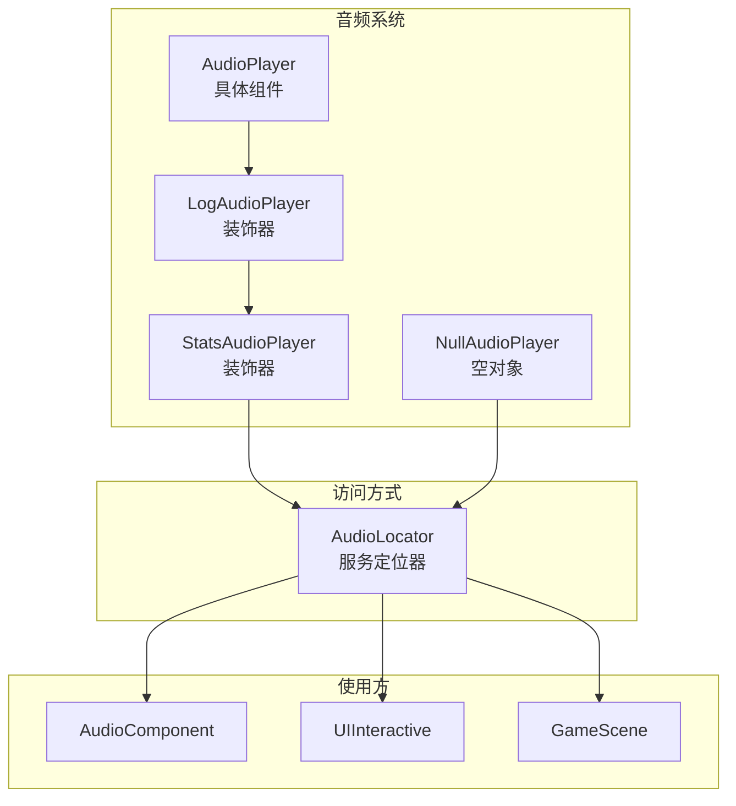

# 开发规范 (Development Guidelines)

## 1. 创建新场景
- 继承 `engine::scene::Scene`。
- 在 `init()` 中使用 `createGameObject` 或 `std::make_unique` 构建初始化实体。
- 通过 `scene_manager_.requestReplaceScene()` 实现场景跳转。
- 对于结束场景 (EndScene)，需要：
  - 在构造函数中处理 `SessionData` 的获取和初始化
  - 在 `createUI()` 方法中构建完整的结束界面
  - 实现游戏胜利/失败状态的显示逻辑
  - 提供重新开始和返回主菜单的功能

## 2. 创建新组件
- 继承 `engine::component::Component`。
- 逻辑代码写在 `update()` 中，渲染代码写在 `render()` 中。
- 获取同对象的其他组件请使用 `owner_->getComponent<T>()`。

## 3. 使用 PhysicsComponent（示例）

- 给对象添加物理：`addComponent<PhysicsComponent>(&context_.getPhysicsEngine())`
- 关闭重力：`setUseGravity(false)`
- 施加一次性力：`addForce(...)`（会在该帧计算完后清空）
- 直接设置速度：`setVelocity(...)`（用于跳跃/冲量类效果）

## 4. 使用音频系统（示例）

### 方式 A：组件内按 action/id 播放

- 给对象添加音频组件：`addComponent<AudioComponent>()`
- 注册音效映射：`registerSound("jump", "assets/sounds/jump.wav")`
- 设置节流（可选）：`setMinIntervalMs(80)`
- 触发播放：`playSound("jump", context)`

### 方式 B：直接播放路径

- 直接播放某个文件：`context.getAudioPlayer().playSound("assets/sounds/coin.wav")`
- 播放 BGM：`context.getAudioPlayer().playMusic("assets/music/level1.ogg")`

## 5. 使用 SessionData（示例）

### 5.1 初始化和获取 SessionData

```cpp
// 初始化 SessionData（通常在 GameApp 中）
auto session_data = game::data::SessionData::getInstance();
// 加载存档数据
session_data->load();
// 设置初始关卡路径
session_data->setMapPath("assets/maps/level1.tmj");
```

### 5.2 获取和修改游戏状态

```cpp
// 获取 SessionData 实例
auto session_data = game::data::SessionData::getInstance();

// 获取游戏状态
int current_health = session_data->getCurrentHealth();
int current_score = session_data->getCurrentScore();
bool is_win = session_data->getIsWin();

// 修改游戏状态
session_data->setCurrentHealth(3);
session_data->setCurrentScore(current_score + 100);
session_data->setIsWin(true); // 设置游戏胜利状态

// 增加得分（推荐使用）
session_data->addScore(50); // 增加 50 分
```

### 5.3 保存和加载游戏数据

```cpp
// 保存游戏数据
auto session_data = game::data::SessionData::getInstance();
session_data->save();

// 加载游戏数据
session_data->load();
```

## 6. 关卡切换时的数据传递（示例）

```cpp
// 在 GameScene 中处理关卡切换
if (player->getName() == "player" && (trigger->getTag() == "next_level" || trigger->getName() == "win")) {
    // 获取 SessionData 实例
    auto session_data = game::data::SessionData::getInstance();
    
    // 保存当前游戏状态
    session_data->save();
    
    // 设置下一关路径
    std::string next_level_path = "assets/maps/" + trigger->getName() + ".tmj";
    session_data->setMapPath(next_level_path);
    
    // 创建新场景并传入会话数据
    auto next_scene = std::make_unique<GameScene>(
        "GameScene", 
        context_, 
        scene_manager_, 
        session_data,
        next_level_path);
    scene_manager_.requestReplaceScene(std::move(next_scene));
}
```

## 7. 性能优化
- **避免在每帧 `update` 中分配内存**: 尽量复用对象。
- **批量渲染**: 相同纹理的对象尽量连续渲染（后续计划）。
- **资源预加载**: 在 `Scene::init()` 中一次性加载场景所需资源。
- **UI 渲染优化**: 对于静态 UI 元素，考虑使用批处理渲染减少绘制调用。
- **状态机优化**: 状态切换逻辑应该简单明了，避免在状态处理中执行复杂计算。
- **精灵管理**: 对于频繁切换的精灵，考虑使用精灵图集减少纹理切换开销。

## 8. UI 系统开发规范

### 8.1 创建交互式 UI 元素
- 继承 `UIInteractive` 类实现自定义交互式元素。
- 为不同状态创建对应的精灵和音效。
- 使用状态模式管理不同的交互状态。

### 8.2 创建按钮
- 使用 `UIButton` 类创建标准按钮。
- 对于精灵按钮，提供正常、悬停、按下三种状态的精灵路径。
- 使用 Lambda 表达式或函数对象设置点击回调。

### 8.3 UI 布局最佳实践
- **使用相对坐标**: 子元素位置相对于父元素，便于整体移动和缩放。
- **分层设计**: 使用 `UIPanel` 作为容器组织相关 UI 元素。
- **响应式布局**: 考虑不同屏幕尺寸的适配（后续计划）。
- **输入处理**: 确保交互式元素正确处理输入事件，避免事件穿透。

### 8.4 资源管理
- **精灵资源**: 按钮精灵应该尺寸一致，便于布局管理。
- **音效资源**: 为不同状态选择合适的音效，增强用户体验。

## 9. 游戏失败检测和场景切换

### 9.1 游戏失败检测
- **生命值检测**: 在 `GameScene::update()` 中检查玩家生命值是否耗尽
- **掉落检测**: 检查玩家位置是否超出屏幕下方，建议设置 100 像素的缓冲区
- **其他失败条件**: 根据游戏设计添加其他失败条件，如时间耗尽等

### 9.2 场景切换最佳实践
- **状态保存**: 在切换场景前保存游戏状态，确保数据持久化
- **状态设置**: 设置游戏胜利/失败状态，用于结束场景的显示
- **错误处理**: 处理 `SessionData` 为空的情况，确保场景切换的安全性
- **调试日志**: 添加详细的调试日志，记录场景切换的原因和过程

### 9.3 实现示例

```cpp
// 游戏失败检测和场景切换示例
if (session_data->getCurrentHealth() <= 0) {
    spdlog::info("玩家生命值耗尽，游戏失败！");
    session_data->setIsWin(false);
    session_data->save();
    
    auto end_scene = std::make_unique<EndScene>(
        context_, 
        scene_manager_, 
        session_data);
    scene_manager_.requestReplaceScene(std::move(end_scene));
    return;
}

// 玩家掉落检测示例
if (player) {
    auto* transform = player->getComponent<engine::component::TransformComponent>();
    if (transform) {
        auto position = transform->getPosition();
        auto viewport_size = context_.getCamera().getViewportSize();
        if (position.y > viewport_size.y + 100.0f) {
            spdlog::info("玩家掉出屏幕，游戏失败！");
            session_data->setIsWin(false);
            session_data->save();
            
            auto end_scene = std::make_unique<EndScene>(
                context_, 
                scene_manager_, 
                session_data);
            scene_manager_.requestReplaceScene(std::move(end_scene));
            return;
        }
    }
}
```

## 10. 使用生成器模式（示例）

### 10.1 从头构建新对象

```cpp
#include "game/object/game_object_builder.h"

// 创建生成器
GameObjectBuilder builder(level_loader, context);

// 构建敌人对象
auto enemy = builder
    .configure(&object_json, &tile_json, tile_info)
    .setEnemyType("eagle")  // 设置敌人类型
    .build()
    .getGameObject();

// 将对象添加到场景
scene->safeAddGameObject(std::move(enemy));
```

### 10.2 使用自动类型检测

```cpp
GameObjectBuilder builder(level_loader, context);

// 根据对象名称自动推断类型
auto game_object = builder
    .configure(&object_json, &tile_json, tile_info)
    .autoDetectType(object_name)  // 自动识别 player/eagle/frog 等
    .build()
    .getGameObject();

scene->safeAddGameObject(std::move(game_object));
```

### 10.3 增强已有对象

```cpp
GameObjectBuilder builder(level_loader, context);

// 为已有对象添加游戏特定组件
builder.autoDetectType("frog")
       .enhance(existing_object)
       .buildEnhancement();

// 现在 existing_object 已经添加了 JumpBehavior AI
```

### 10.4 支持的类型映射

| 名称 | 类型 | 自动添加的组件 |
|:---|:---|:---|
| "player" | 玩家 | PlayerComponent + 状态机 |
| "eagle" | 敌人 | AIComponent + UpDownBehavior |
| "frog" | 敌人 | AIComponent + JumpBehavior |
| "opossum" | 敌人 | AIComponent + PatrolBehavior |
| "fruit" | 道具 | 动画播放 + "item" 标签 |
| "gem" | 道具 | 动画播放 + "item" 标签 |

## 11. 使用 GameState（示例）

### 11.1 初始化 GameState

```cpp
// 在 GameApp 中初始化
auto game_state = std::make_unique<engine::core::GameState>(
    renderer, 
    window, 
    engine::core::GameStateType::Title
);
```

### 11.2 状态切换

```cpp
// 开始游戏
void TitleScene::onStartClicked() {
    context_.getGameState().setState(engine::core::GameStateType::Playing);
    scene_manager_.requestReplaceScene(std::make_unique<GameScene>(...));
}

// 暂停游戏
void GameScene::handleInput() {
    if (input_manager.isActionPressed("pause")) {
        if (game_state_.isPlaying()) {
            game_state_.setState(engine::core::GameStateType::Paused);
            scene_manager_.requestPushScene(std::make_unique<MenuScene>(...));
        }
    }
}

// 恢复游戏
void MenuScene::onResumeClicked() {
    context_.getGameState().setState(engine::core::GameStateType::Playing);
    scene_manager_.requestPopScene();
}
```

### 11.3 根据状态处理逻辑

```cpp
void GameScene::update(float delta_time) {
    // 只有在游戏进行中状态才更新游戏逻辑
    if (!context_.getGameState().isPlaying()) {
        return;
    }
    
    // 更新物理
    context_.getPhysicsEngine().update(delta_time);
    
    // 更新游戏对象
    for (auto& game_object : game_objects_) {
        game_object->update(delta_time, context_);
    }
}
```

### 11.4 窗口尺寸查询

```cpp
// 获取窗口逻辑尺寸（用于 UI 布局）
auto window_size = context_.getGameState().getWindowLogicalSize();
float center_x = window_size.x / 2.0f;
float center_y = window_size.y / 2.0f;

// 创建居中的 UI 元素
auto button = std::make_unique<UIButton>(
    context_,
    normal_sprite,
    hover_sprite,
    pressed_sprite,
    glm::vec2(center_x - button_width / 2, center_y - button_height / 2),
    glm::vec2(button_width, button_height),
    callback
);
```

## 12. 使用命令模式（示例）

### 12.1 初始化命令映射器

```cpp
#include "game/command/command_mapper.h"
#include "game/command/player_commands.h"

void GameScene::initCommandMapper() {
    command_mapper_ = std::make_unique<game::command::CommandMapper>();

    // 绑定动作到命令
    command_mapper_->bind("move_left", 
        std::make_unique<game::command::MoveLeftCommand>(player_component_));
    command_mapper_->bind("move_right", 
        std::make_unique<game::command::MoveRightCommand>(player_component_));
    command_mapper_->bind("jump", 
        std::make_unique<game::command::JumpCommand>(player_component_));
    command_mapper_->bind("attack", 
        std::make_unique<game::command::AttackCommand>(player_component_));
    command_mapper_->bind("climb_up", 
        std::make_unique<game::command::ClimbUpCommand>(player_component_));
    command_mapper_->bind("climb_down", 
        std::make_unique<game::command::ClimbDownCommand>(player_component_));
    command_mapper_->bind("stop_move", 
        std::make_unique<game::command::StopMoveCommand>(player_component_));
}
```

### 12.2 在输入处理中使用命令

```cpp
bool GameScene::handleInput() {
    Scene::handleInput();
    auto& input_manager = context_.getInputManager();

    // 处理移动输入
    if (input_manager.isActionDown("move_left")) {
        command_mapper_->execute("move_left", context_);
    }
    else if (input_manager.isActionDown("move_right")) {
        command_mapper_->execute("move_right", context_);
    }
    else {
        command_mapper_->execute("stop_move", context_);
    }

    // 处理跳跃输入（按下触发）
    if (input_manager.isActionPressed("jump")) {
        command_mapper_->execute("jump", context_);
    }

    // 处理攻击输入（按下触发）
    if (input_manager.isActionPressed("attack")) {
        command_mapper_->execute("attack", context_);
    }

    return true;
}
```

### 12.3 创建自定义命令

```cpp
#include "game/command/player_commands.h"

// 继承 PlayerCommand 基类
class DashCommand : public game::command::PlayerCommand {
    game::component::PlayerComponent* player_;
public:
    explicit DashCommand(game::component::PlayerComponent* player) : player_(player) {}
    
    void execute(engine::core::Context& context) override {
        if (player_) {
            // 实现冲刺逻辑
            player_->dash(context);
        }
    }
};

// 在 PlayerComponent 中添加 dash 方法
void PlayerComponent::dash(engine::core::Context& context) {
    if (!current_state_) return;
    auto new_state = current_state_->dash(context);
    if (new_state) {
        setState(std::move(new_state));
    }
}
```

### 12.4 实现双人控制切换

```cpp
void GameScene::switchPlayer() {
    // 查找第二个玩家
    auto* player2 = findGameObjectByName("player2");
    if (!player2) return;

    // 切换当前控制玩家
    current_controlled_player_ = (current_controlled_player_ == player_) 
        ? player2 : player_;

    // 切换相机跟随
    auto* transform = current_controlled_player_->getComponent<TransformComponent>();
    context_.getCamera().setTarget(transform);

    // 重新绑定命令到新玩家
    auto* new_player_component = current_controlled_player_
        ->getComponent<game::component::PlayerComponent>();
    if (new_player_component) {
        rebindCommandMapper(new_player_component);
    }
}

void GameScene::rebindCommandMapper(game::component::PlayerComponent* player_component) {
    // 清除现有命令
    command_mapper_->clear();
    
    // 重新绑定所有命令到新玩家
    command_mapper_->bind("move_left", 
        std::make_unique<game::command::MoveLeftCommand>(player_component));
    command_mapper_->bind("move_right", 
        std::make_unique<game::command::MoveRightCommand>(player_component));
    command_mapper_->bind("jump", 
        std::make_unique<game::command::JumpCommand>(player_component));
    command_mapper_->bind("attack", 
        std::make_unique<game::command::AttackCommand>(player_component));
    command_mapper_->bind("climb_up", 
        std::make_unique<game::command::ClimbUpCommand>(player_component));
    command_mapper_->bind("climb_down", 
        std::make_unique<game::command::ClimbDownCommand>(player_component));
    command_mapper_->bind("stop_move", 
        std::make_unique<game::command::StopMoveCommand>(player_component));
}
```

### 12.5 命令模式最佳实践

1. **单一职责**: 每个命令类只负责一个具体的动作
2. **空检查**: 在 execute() 中始终检查 player_ 指针是否为空
3. **资源管理**: 使用 unique_ptr 管理命令对象，避免内存泄漏
4. **动态绑定**: 利用 CommandMapper 的动态绑定特性，支持运行时切换
5. **输入映射**: 在 config.h 中定义新的输入动作，保持一致性

### 12.6 支持的命令列表

| 命令类 | 功能 | 使用场景 |
|:---|:---|:---|
| `MoveLeftCommand` | 向左移动 | 按住 A 或 Left 键 |
| `MoveRightCommand` | 向右移动 | 按住 D 或 Right 键 |
| `JumpCommand` | 跳跃 | 按下 J 或 Space 键 |
| `AttackCommand` | 攻击 | 按下 K 或鼠标左键 |
| `ClimbUpCommand` | 向上攀爬 | 在梯子上按 W 或 Up 键 |
| `ClimbDownCommand` | 向下攀爬 | 在梯子上按 S 或 Down 键 |
| `StopMoveCommand` | 停止移动 | 无移动输入时自动触发 |

## 13. 使用脏标识模式（示例）

本项目使用 **脏标识模式 (Dirty Flag Pattern)** 优化 UI 文本渲染性能。以下是使用指南：

### 13.1 基本使用

`UIText` 组件内部已集成脏标识机制，无需手动管理：

```cpp
// 创建文本控件
auto score_text = std::make_unique<UIText>(
    context_, 
    "Score: 0", 
    "assets/fonts/PixelOperator8.ttf", 
    24
);

// 设置文本会自动标记脏状态
score_text->setText("Score: 100");  // is_dirty_ = true

// 获取尺寸会自动刷新（如果脏）
glm::vec2 size = score_text->getSize();  // 触发尺寸计算

// 渲染后会自动清除脏标记
score_text->render();  // 渲染并清除脏状态
```

### 13.2 与观察者模式结合

脏标识模式与观察者模式结合，实现数据变化时自动更新：

```cpp
class ScoreDisplay : public UIText {
public:
    void onNotify(EventType event_type, const std::any& data) override {
        if (event_type == EventType::SCORE_CHANGED) {
            if (const int* score = std::any_cast<int>(&data)) {
                setText("Score: " + std::to_string(*score));
                // setText 内部自动设置 is_dirty_ = true
            }
        }
    }
};

// 在 GameScene 中设置订阅
void GameScene::initHUD() {
    auto score_display = std::make_unique<ScoreDisplay>(...);
    session_data_->addObserver(score_display.get());
    // 当 SessionData 的分数变化时，ScoreDisplay 自动更新
}
```

### 13.3 性能优化建议

1. **避免频繁调用 setText()**
   ```cpp
   // 不推荐：每帧都设置相同文本
   void update() {
       score_text->setText("Score: " + std::to_string(score));  // 浪费性能
   }
   
   // 推荐：只在数据变化时设置
   void onScoreChanged(int new_score) {
       if (new_score != current_score_) {
           score_text->setText("Score: " + std::to_string(new_score));
           current_score_ = new_score;
       }
   }
   ```

2. **批量更新**
   ```cpp
   // 如果有多个文本需要更新，先批量设置，最后统一渲染
   void updateHUD() {
       // 设置所有文本（标记脏状态）
       score_text->setText(...);
       health_text->setText(...);
       level_text->setText(...);
       
       // 统一渲染（每个控件内部处理脏状态）
       ui_manager->render();
   }
   ```

3. **缓存尺寸计算结果**
   ```cpp
   // 如果需要在布局阶段多次使用尺寸
   void layoutUI() {
       // 第一次调用会计算尺寸
       glm::vec2 size = text->getSize();
       
       // 后续调用直接返回缓存值（如果未标记脏）
       float width = text->getSize().x;   // 使用缓存
       float height = text->getSize().y;  // 使用缓存
   }
   ```

### 13.4 底层 API 使用（高级）

如果需要直接使用 `TextRenderer` 的脏标识功能：

```cpp
// 获取 TextRenderer
auto& text_renderer = context_.getTextRenderer();

// 绘制UI文本，手动控制脏状态
bool is_dirty = has_text_changed_;  // 根据业务逻辑判断
text_renderer.drawUIText(
    text, font_path, font_size, position, color, is_dirty
);

// 获取文本尺寸，手动控制脏状态
glm::vec2 size = text_renderer.getTextSize(
    text, font_path, font_size, is_dirty
);
```

### 13.5 脏标识模式最佳实践

1. **延迟计算**: Setter 只标记脏状态，不立即执行昂贵操作
2. **访问时刷新**: 在获取值或渲染时检查并刷新脏状态
3. **自动传播**: UI层将脏状态传递给渲染层，避免重复检查
4. **及时清除**: 渲染后立即清除脏标记，避免不必要的重复计算
5. **生命周期管理**: 注意缓存对象的生命周期，确保在系统关闭前正确释放

## 14. 使用服务定位器模式（示例）

本项目在音频系统中使用 **服务定位器模式 (Service Locator Pattern)** 作为依赖注入的补充方案。以下是使用指南：

### 14.1 基本使用

音频系统通过 `AudioLocator` 提供全局访问：

```cpp
#include "engine/audio/audio_locator.h"

// 播放音效
engine::audio::AudioLocator::get().playSound("assets/audio/jump.wav");

// 播放背景音乐
engine::audio::AudioLocator::get().playMusic("assets/audio/background.ogg");

// 停止音乐
engine::audio::AudioLocator::get().stopMusic();

// 设置音量
engine::audio::AudioLocator::get().setMasterVolume(0.8f);
engine::audio::AudioLocator::get().setSoundVolume(0.5f);
engine::audio::AudioLocator::get().setMusicVolume(0.7f);
```

### 14.2 在组件中使用

```cpp
// audio_component.h
#pragma once
#include "component.h"
#include <string>
#include <unordered_map>

namespace engine::component {

class AudioComponent : public Component {
private:
    std::unordered_map<std::string, std::string> action_sounds_;

public:
    void registerSound(const std::string& action, const std::string& file_path) {
        action_sounds_[action] = file_path;
    }
    
    void play(const std::string& action) {
        auto it = action_sounds_.find(action);
        if (it != action_sounds_.end()) {
            // 通过服务定位器播放音效
            engine::audio::AudioLocator::get().playSound(it->second);
        }
    }
    
    void playSpatial(const std::string& action, 
                     const glm::vec2& emitter_pos,
                     const glm::vec2& listener_pos,
                     float max_distance) {
        auto it = action_sounds_.find(action);
        if (it != action_sounds_.end()) {
            engine::audio::AudioLocator::get().playSoundSpatial(
                it->second, emitter_pos, listener_pos, max_distance);
        }
    }
};

} // namespace engine::component
```

**使用示例**:

```cpp
// 创建音频组件
auto audio_component = std::make_unique<AudioComponent>();
audio_component->registerSound("jump", "assets/audio/jump.wav");
audio_component->registerSound("attack", "assets/audio/attack.wav");
audio_component->registerSound("hurt", "assets/audio/hurt.wav");

// 在玩家跳跃时播放音效
void PlayerComponent::jump() {
    if (auto* audio = owner_->getComponent<AudioComponent>()) {
        audio->play("jump");
    }
}
```

### 14.3 在UI中使用

```cpp
// 创建带音效的按钮
auto button = std::make_unique<UIButton>(
    context_,
    "assets/textures/button_normal.png",
    "assets/textures/button_hover.png",
    "assets/textures/button_pressed.png",
    glm::vec2(100.0f, 100.0f),
    glm::vec2(200.0f, 50.0f),
    [this]() { this->startGame(); }
);

// 设置按钮点击音效
button->setSoundFile("assets/audio/button_click.wav");
```

**UIInteractive 实现**:

```cpp
void UIInteractive::handleClick() {
    // 播放点击音效
    if (!sound_file_.empty()) {
        engine::audio::AudioLocator::get().playSound(sound_file_);
    }
    
    // 执行点击回调
    if (on_click_) {
        on_click_();
    }
}
```

### 14.4 在场景中使用

```cpp
class GameScene : public Scene {
public:
    void enter() override {
        // 进入场景时播放背景音乐
        engine::audio::AudioLocator::get().playMusic(
            "assets/audio/level_music.ogg", -1);  // -1 表示循环播放
    }
    
    void exit() override {
        // 离开场景时停止音乐
        engine::audio::AudioLocator::get().stopMusic();
    }
    
    void onPlayerScore(int points) {
        // 播放得分音效
        engine::audio::AudioLocator::get().playSound("assets/audio/score.wav");
    }
};
```

### 14.5 3D空间化音效

```cpp
// 获取玩家位置（听众位置）
glm::vec2 listener_pos = player_->getComponent<TransformComponent>()->getPosition();

// 获取敌人位置（发射器位置）
for (auto* enemy : enemies_) {
    glm::vec2 emitter_pos = enemy->getComponent<TransformComponent>()->getPosition();
    
    // 播放空间化音效，最大距离为 500 像素
    if (auto* audio = enemy->getComponent<AudioComponent>()) {
        audio->playSpatial("roar", emitter_pos, listener_pos, 500.0f);
    }
}
```

### 14.6 服务定位器 vs 依赖注入

#### 何时使用服务定位器？

```cpp
// ✅ 适合使用服务定位器：需要全局访问，调用点分散
class AudioComponent : public Component {
    void play(const std::string& action) {
        // 音频播放可能发生在任何地方
        engine::audio::AudioLocator::get().playSound(path);
    }
};

// ✅ 适合使用服务定位器：工具类，不需要显式依赖声明
class UIInteractive : public UIElement {
    void handleClick() {
        // UI 元素播放音效是可选功能
        if (!sound_file_.empty()) {
            engine::audio::AudioLocator::get().playSound(sound_file_);
        }
    }
};
```

#### 何时使用依赖注入？

```cpp
// ✅ 适合使用依赖注入：核心依赖，生命周期重要
class SpriteComponent : public Component {
public:
    explicit SpriteComponent(ResourceManager& resource_manager)
        : resource_manager_(resource_manager) {}
    
private:
    ResourceManager& resource_manager_;  // 核心依赖
};

// ✅ 适合使用依赖注入：需要 Mock 进行单元测试
class PhysicsComponent : public Component {
public:
    explicit PhysicsComponent(PhysicsEngine& physics_engine)
        : physics_engine_(physics_engine) {}
    
private:
    PhysicsEngine& physics_engine_;  // 需要 Mock 测试
};
```

### 14.7 最佳实践

1. **优先使用依赖注入**
   ```cpp
   // 推荐：核心系统使用依赖注入
   class RenderSystem {
   public:
       explicit RenderSystem(ResourceManager& rm) : resource_manager_(rm) {}
   };
   
   // 仅在必要时使用服务定位器
   class AudioComponent {
       void play() {
           engine::audio::AudioLocator::get().playSound(path);
       }
   };
   ```

2. **处理服务未初始化的情况**
   ```cpp
   // 不需要检查，NullAudioPlayer 会静默处理
   void AudioComponent::play(const std::string& action) {
       auto it = action_sounds_.find(action);
       if (it != action_sounds_.end()) {
           // 即使 AudioLocator 未注册服务，也不会崩溃
           engine::audio::AudioLocator::get().playSound(it->second);
       }
   }
   ```

3. **音量控制策略**
   ```cpp
   // 在设置菜单中调整音量
   void SettingsScene::onMasterVolumeChanged(float volume) {
       engine::audio::AudioLocator::get().setMasterVolume(volume);
   }
   
   void SettingsScene::onMusicVolumeChanged(float volume) {
       engine::audio::AudioLocator::get().setMusicVolume(volume);
   }
   
   void SettingsScene::onSoundVolumeChanged(float volume) {
       engine::audio::AudioLocator::get().setSoundVolume(volume);
   }
   ```

4. **音效节流**
   ```cpp
   // 避免同一音效过于频繁播放
   void AudioComponent::play(const std::string& action) {
       auto now = SDL_GetTicks();
       auto it = last_play_time_.find(action);
       if (it != last_play_time_.end() && 
           now - it->second < min_interval_ms_) {
           return;  // 跳过播放
       }
       
       // 播放音效...
       engine::audio::AudioLocator::get().playSound(path);
       last_play_time_[action] = now;
   }
   ```

5. **生命周期管理**
   ```cpp
   // GameApp 负责音频系统的初始化和关闭
   bool GameApp::init() {
       // 1. 创建音频播放器（依赖注入）
       audio_player_ = std::make_unique<AudioPlayer>(
           *resource_manager_, *config_);
       
       // 2. 注册到服务定位器
       engine::audio::AudioLocator::provide(audio_player_.get());
       
       return true;
   }
   
   void GameApp::clean() {
       // 1. 注销服务（恢复为空服务）
       engine::audio::AudioLocator::provide(nullptr);
       
       // 2. 销毁音频播放器
       audio_player_.reset();
   }
   ```

### 14.8 注意事项

1. **不要滥用服务定位器**: 仅在真正需要全局访问的场景使用
2. **注意线程安全**: 本项目单线程访问无需考虑，多线程需要添加同步
3. **服务生命周期**: 确保服务在使用期间有效，避免悬垂指针
4. **测试考虑**: 测试时可以替换为 Mock 实现
   ```cpp
   // 测试代码
   class MockAudioPlayer : public IAudioPlayer {
       // Mock 实现...
   };
   
   MockAudioPlayer mock_audio;
   AudioLocator::provide(&mock_audio);
   // 执行测试...
   AudioLocator::provide(nullptr);  // 恢复
   ```

## 15. 使用装饰器模式（示例）

本项目在音频系统中使用 **装饰器模式 (Decorator Pattern)** 动态扩展功能。以下是使用指南：

### 15.1 基本使用

装饰器模式允许在不修改原有代码的情况下为对象添加新功能：

```cpp
#include "engine/audio/audio_player.h"
#include "engine/audio/log_audio_player.h"

// 1. 创建具体组件
auto audio_player = std::make_unique<engine::audio::AudioPlayer>(
    resource_manager, config);

// 2. 用装饰器包装（添加日志功能）
auto logging_player = std::make_unique<engine::audio::LogAudioPlayer>(
    std::move(audio_player));

// 3. 使用（透明，与原始对象使用方式相同）
logging_player->playSound("assets/audio/jump.wav");
// 输出: [info] LogAudioPlayer: 播放音效 assets/audio/jump.wav

logging_player->playMusic("assets/audio/background.ogg");
// 输出: [info] LogAudioPlayer: 播放音乐 assets/audio/background.ogg, 循环次数 -1
```

### 15.2 在项目中启用日志装饰器

通过编译宏 `ENABLE_AUDIO_LOG` 控制日志功能的启用：

```cpp
// game_app.cpp
bool GameApp::initAudioPlayer() {
    try {
        // 创建音频播放器
        audio_player_ = std::make_unique<engine::audio::AudioPlayer>(
            *resource_manager_, *config_);
        
#ifdef ENABLE_AUDIO_LOG
        // 启用日志装饰器
        audio_player_ = std::make_unique<engine::audio::LogAudioPlayer>(
            std::move(audio_player_));
        spdlog::info("音频日志功能已启用");
#endif
        
        // 注册到服务定位器
        engine::audio::AudioLocator::provide(audio_player_.get());
        
    } catch (const std::exception& e) {
        spdlog::error("初始化音频播放器失败: {}", e.what());
        return false;
    }
    return true;
}
```

**CMake 配置**:

```cmake
# 启用音频日志
option(ENABLE_AUDIO_LOG "Enable audio logging" ON)

if(ENABLE_AUDIO_LOG)
    target_compile_definitions(${PROJECT_NAME} PRIVATE ENABLE_AUDIO_LOG)
endif()
```

### 15.3 创建自定义装饰器

你可以创建自己的装饰器来扩展音频功能：

```cpp
// stats_audio_player.h
#pragma once
#include "engine/audio/iaudio_player.h"
#include <memory>
#include <unordered_map>
#include <string>

namespace engine::audio {

class StatsAudioPlayer : public IAudioPlayer {
    std::unique_ptr<IAudioPlayer> wrapped_player_;
    std::unordered_map<std::string, int> play_counts_;
    int total_plays_ = 0;

public:
    explicit StatsAudioPlayer(std::unique_ptr<IAudioPlayer> wrapped_player)
        : wrapped_player_(std::move(wrapped_player)) {}

    int playSound(const std::string& path) override {
        play_counts_[path]++;
        total_plays_++;
        return wrapped_player_->playSound(path);
    }

    int playSoundSpatial(const std::string& path, 
                         const glm::vec2& emitter_world_pos,
                         const glm::vec2& listener_world_pos, 
                         float max_distance) override {
        play_counts_[path]++;
        total_plays_++;
        return wrapped_player_->playSoundSpatial(path, emitter_world_pos, 
                                                  listener_world_pos, max_distance);
    }

    bool playMusic(const std::string& path, int loops = -1) override {
        return wrapped_player_->playMusic(path, loops);
    }

    // ... 其他方法委托给 wrapped_player_

    void printStats() const {
        spdlog::info("===== 音频播放统计 =====");
        spdlog::info("总播放次数: {}", total_plays_);
        for (const auto& [path, count] : play_counts_) {
            spdlog::info("  {}: {} 次", path, count);
        }
    }

    int getPlayCount(const std::string& path) const {
        auto it = play_counts_.find(path);
        return it != play_counts_.end() ? it->second : 0;
    }

    void resetStats() {
        play_counts_.clear();
        total_plays_ = 0;
    }

    // 委托方法...
    void setMasterVolume(float volume) override {
        wrapped_player_->setMasterVolume(volume);
    }
    
    float getMasterVolume() const override {
        return wrapped_player_->getMasterVolume();
    }
    
    // ... 其他委托方法
};

} // namespace engine::audio
```

**使用示例**:

```cpp
// 创建统计装饰器
auto audio_player = std::make_unique<AudioPlayer>(resource_manager, config);
auto stats_player = std::make_unique<StatsAudioPlayer>(std::move(audio_player));

// 播放音效
stats_player->playSound("assets/audio/jump.wav");
stats_player->playSound("assets/audio/jump.wav");
stats_player->playSound("assets/audio/coin.wav");

// 查看统计
stats_player->printStats();
// 输出:
// ===== 音频播放统计 =====
// 总播放次数: 3
//   assets/audio/jump.wav: 2 次
//   assets/audio/coin.wav: 1 次
```

### 15.4 嵌套装饰器

可以嵌套多个装饰器，每个添加不同功能：

```cpp
// 嵌套装饰器示例
auto audio_player = std::make_unique<AudioPlayer>(resource_manager, config);

// 第一层：添加日志
auto logging_player = std::make_unique<LogAudioPlayer>(
    std::move(audio_player));

// 第二层：添加统计
auto stats_player = std::make_unique<StatsAudioPlayer>(
    std::move(logging_player));

// 第三层：添加音量限制（示例）
// auto limit_player = std::make_unique<VolumeLimitAudioPlayer>(
//     std::move(stats_player), 0.8f);

// 使用（所有功能都会生效）
stats_player->playSound("assets/audio/jump.wav");
// 1. LogAudioPlayer 记录日志
// 2. StatsAudioPlayer 更新统计
// 3. AudioPlayer 实际播放
```

### 15.5 装饰器 vs 继承

#### 为什么不使用继承？

```cpp
// ❌ 继承方式：不够灵活
class LoggingAudioPlayer : public AudioPlayer {
public:
    int playSound(const std::string& path) override {
        spdlog::info("播放: {}", path);
        return AudioPlayer::playSound(path);
    }
};

// 问题：
// 1. 如果要给另一个音频类添加日志，需要再写一个子类
// 2. 无法动态组合功能（日志+统计+缓存）
// 3. 紧耦合，依赖具体类而非接口
```

#### 装饰器方式的优势：

```cpp
// ✅ 装饰器方式：灵活、可组合
auto player = std::make_unique<AudioPlayer>(...);
auto logging = std::make_unique<LogAudioPlayer>(std::move(player));
auto stats = std::make_unique<StatsAudioPlayer>(std::move(logging));

// 优势：
// 1. 可以给任何 IAudioPlayer 实现添加功能
// 2. 可以动态组合多个功能
// 3. 松耦合，依赖接口而非具体类
```

### 15.6 最佳实践

1. **保持接口一致性**: 装饰器必须完全实现组件接口，不能遗漏任何方法
   ```cpp
   // ✅ 正确：实现所有接口方法
   class MyDecorator : public IAudioPlayer {
       void setMasterVolume(float volume) override {
           // 先执行额外逻辑
           logVolumeChange(volume);
           // 再调用被装饰对象
           wrapped_->setMasterVolume(volume);
       }
       // ... 实现所有其他方法
   };
   ```

2. **优先使用组合**: 通过持有被装饰对象实现，而非继承
   ```cpp
   // ✅ 正确：使用组合
   class Decorator : public IAudioPlayer {
       std::unique_ptr<IAudioPlayer> wrapped_;  // 组合
   };
   
   // ❌ 避免：使用继承（紧耦合）
   class Decorator : public AudioPlayer {  // 继承具体类
   };
   ```

3. **避免过度装饰**: 装饰器层次过多会增加调试难度
   ```cpp
   // ❌ 避免：过多嵌套
   auto p1 = std::make_unique<A>(std::move(base));
   auto p2 = std::make_unique<B>(std::move(p1));
   auto p3 = std::make_unique<C>(std::move(p2));
   auto p4 = std::make_unique<D>(std::move(p3));  // 难以调试
   
   // ✅ 推荐：适度使用，必要时合并功能
   auto player = std::make_unique<CombinedDecorator>(std::move(base));
   ```

4. **文档化装饰器**: 明确说明装饰器添加的功能
   ```cpp
   /**
    * @brief 日志音频装饰器
    * @details 为音频播放器添加日志记录功能，记录所有播放操作
    * @note 通过 ENABLE_AUDIO_LOG 宏控制启用
    */
   class LogAudioPlayer : public IAudioPlayer {
       // ...
   };
   ```

5. **考虑性能**: 装饰器会增加一层间接调用
   ```cpp
   // 性能敏感场景考虑直接调用
   // 装饰器适合：日志、统计、调试
   // 装饰器不适合：高频调用的性能关键路径
   ```

6. **正确处理方法返回值**
   ```cpp
   int playSound(const std::string& path) override {
       logPlay(path);
       int result = wrapped_->playSound(path);  // 获取返回值
       logResult(result);  // 可以记录返回值
       return result;  // 正确返回
   }
   ```

### 15.7 常见应用场景

1. **日志记录**: `LogAudioPlayer` - 记录所有音频操作
2. **性能统计**: `StatsAudioPlayer` - 统计播放次数和时长
3. **参数校验**: `ValidationAudioPlayer` - 校验音量、路径等参数
4. **缓存**: `CachedAudioPlayer` - 缓存音频数据
5. **音量限制**: `VolumeLimitAudioPlayer` - 限制最大音量
6. **调试**: `DebugAudioPlayer` - 添加断点、可视化等调试功能

### 15.8 与项目其他模式的配合



- **装饰器模式**: 扩展音频功能（日志、统计）
- **空对象模式**: 提供默认实现
- **服务定位器模式**: 提供全局访问
- **组件模式**: 在游戏中使用音频

这种组合实现了灵活、可扩展的音频系统架构。